# Monoceros

 **Monoceros**: a Wave Function
Collapse plug-in for Grasshopper by Subdigital

## 1. Authors

- Ján Pernecký: [jan@sub.digital](mailto:jan@sub.digital)
- Ján Tóth: [yanchi.toth@gmail.com](mailto:yanchi.toth@gmail.com),
  [yanchith](https://yanchith.github.io), [GitHub](https://github.com/yanchith)
- **Subdigital**: [sub.digital](https://www.sub.digtial),
  [GitHub](https://github.com/subdgtl)

## 2. Tl;dr

**Monoceros is a Grasshopper plug-in that fills the entire world with Modules,
respecting the given Rules.**

## 3. Table of contents

- [1. Authors](#1-authors)
- [2. Tl;dr](#2-tldr)
- [3. Table of contents](#3-table-of-contents)
- [4. Meet Monoceros](#4-meet-monoceros)
- [5. Wave Function Collapse](#5-wave-function-collapse)
- [6. Development notes](#6-development-notes)
- [7. Architecture of Monoceros Grasshopper plug-in](#7-architecture-of-monoceros-grasshopper-plug-in)
- [8. Data types](#8-data-types)
  - [8.1. Slot](#81-slot)
    - [8.1.1. States](#811-states)
    - [8.1.2. Slot Properties](#812-slot-properties)
    - [8.1.3. Automatic Envelope wrapping](#813-automatic-envelope-wrapping)
    - [8.1.4. Modules and their Parts](#814-modules-and-their-parts)
    - [8.1.5. Viewport preview and baking](#815-viewport-preview-and-baking)
    - [8.1.6. Slot casts to](#816-slot-casts-to)
  - [8.2. Module](#82-module)
    - [8.2.1. Monoceros Module Parts](#821-monoceros-module-parts)
    - [8.2.2. Connectors](#822-connectors)
    - [8.2.3. Module Geometry](#823-module-geometry)
    - [8.2.4. Orientation and placement](#824-orientation-and-placement)
    - [8.2.5. Module Properties](#825-module-properties)
    - [8.2.6. Special Modules: Out and Empty](#826-special-modules-out-and-empty)
    - [8.2.7. Viewport preview and baking](#827-viewport-preview-and-baking)
    - [8.2.8. Module casts](#828-module-casts)
  - [8.3. Rule](#83-rule)
    - [8.3.1. Explicit Rule](#831-explicit-rule)
      - [8.3.1.1. Explicit Rule properties](#8311-explicit-rule-properties)
      - [8.3.1.2. Explicit Rule casts](#8312-explicit-rule-casts)
      - [8.3.1.3. Explicit Rule Viewport preview and baking](#8313-explicit-rule-viewport-preview-and-baking)
    - [8.3.2. Typed Rule](#832-typed-rule)
      - [8.3.2.1. Typed Rule properties](#8321-typed-rule-properties)
      - [8.3.2.2. Typed Rule casts](#8322-typed-rule-casts)
      - [8.3.2.3. Typed Rule Viewport preview and baking](#8323-typed-rule-viewport-preview-and-baking)
    - [8.3.3. Indifferent Typed Rule](#833-indifferent-typed-rule)
- [9. Monoceros WFC Solver](#9-monoceros-wfc-solver)
  - [9.1. Rule and Module Lowering](#91-rule-and-module-lowering)
  - [9.2. 1.7.2 Canonical World State](#92-172-canonical-world-state)
- [10. Components](#10-components)
  - [10.1. Slot-related](#101-slot-related)
    - [10.1.1. Construct Slot With All Modules Allowed](#1011-construct-slot-with-all-modules-allowed)
    - [10.1.2. Construct Slot With Listed Modules Allowed](#1012-construct-slot-with-listed-modules-allowed)
    - [10.1.3. Deconstruct Slot](#1013-deconstruct-slot)
    - [10.1.4. Are Slots Boundary](#1014-are-slots-boundary)
    - [10.1.5. Add Boundary Layer](#1015-add-boundary-layer)
  - [10.2. Module-related](#102-module-related)
    - [10.2.1. Construct Module](#1021-construct-module)
    - [10.2.2. Construct Empty Module](#1022-construct-empty-module)
    - [10.2.3. Deconstruct Module](#1023-deconstruct-module)
  - [10.3. Rule-related](#103-rule-related)
    - [10.3.1. Construct Explicit Rule](#1031-construct-explicit-rule)
    - [10.3.2. Deconstruct Explicit Rule](#1032-deconstruct-explicit-rule)
    - [10.3.3. Is Rule Explicit](#1033-is-rule-explicit)
    - [10.3.4. Construct Typed Rule](#1034-construct-typed-rule)
    - [10.3.5. Deconstruct Typed Rule](#1035-deconstruct-typed-rule)
    - [10.3.6. Is Rule Typed](#1036-is-rule-typed)
    - [10.3.7. Unwrap Typed Rules](#1037-unwrap-typed-rules)
    - [10.3.8. Collect Rules](#1038-collect-rules)
    - [10.3.9. Explicit Rule From Curve](#1039-explicit-rule-from-curve)
    - [10.3.10. Typed Rule From Point](#10310-typed-rule-from-point)
    - [10.3.11. Rule At Boundary From Point](#10311-rule-at-boundary-from-point)
    - [10.3.12. Indifferent Rule From Point](#10312-indifferent-rule-from-point)
    - [10.3.13. Indifferent Rules For Unused Connectors](#10313-indifferent-rules-for-unused-connectors)
  - [10.4. Solver](#104-solver)
    - [10.4.1. Monoceros WFC Solver](#1041-monoceros-wfc-solver)
  - [10.5. Post processing](#105-post-processing)
    - [10.5.1. Materialize Slots](#1051-materialize-slots)
    - [10.5.2. Assemble Rule](#1052-assemble-rule)
    - [10.5.3. Rule Preview](#1053-rule-preview)
  - [10.6. Supplemental](#106-supplemental)
    - [10.6.1. Slice Geometry](#1061-slice-geometry)
- [11. Examples](#11-examples)
  - [11.1. Bare minimum](#111-bare-minimum)
    - [11.1.1. Pseudo code](#1111-pseudo-code)
    - [11.1.2. Definition](#1112-definition)
    - [11.1.3. Breakdown](#1113-breakdown)
  - [11.2. Explicit Rules](#112-explicit-rules)
    - [11.2.1. Definition: Explicit Rule from a literal](#1121-definition-explicit-rule-from-a-literal)
    - [11.2.2. Definition: Explicit Rule from components](#1122-definition-explicit-rule-from-components)
    - [11.2.3. Definition: Explicit Rule from curve](#1123-definition-explicit-rule-from-curve)
  - [11.3. Typed Rules](#113-typed-rules)
    - [11.3.1. Definition: Typed Rule from a literal](#1131-definition-typed-rule-from-a-literal)
    - [11.3.2. Definition: Typed Rule from components](#1132-definition-typed-rule-from-components)
    - [11.3.3. Definition: Typed Rule from components using Module as Name](#1133-definition-typed-rule-from-components-using-module-as-name)
    - [11.3.4. Definition: Typed Rule from Point tag](#1134-definition-typed-rule-from-point-tag)
  - [11.4. Indifferent Rules](#114-indifferent-rules)
    - [11.4.1. Definition: Indifferent Rules for unused Connectors](#1141-definition-indifferent-rules-for-unused-connectors)
    - [11.4.2. Definition: Indifferent Rules manual assignment](#1142-definition-indifferent-rules-manual-assignment)
    - [11.4.3. Definition: Indifferent Rules literal assignment](#1143-definition-indifferent-rules-literal-assignment)
  - [11.5. Defining more Modules at once](#115-defining-more-modules-at-once)
    - [11.5.1. Pseudo code: (almost) without data trees](#1151-pseudo-code-almost-without-data-trees)
    - [11.5.2. Definition: (almost) without data trees](#1152-definition-almost-without-data-trees)
    - [11.5.3. Pseudo code: with data trees](#1153-pseudo-code-with-data-trees)
    - [11.5.4. Definition: with data trees](#1154-definition-with-data-trees)
    - [11.5.5. Result](#1155-result)
  - [11.6. Slots and Module Parts with non-uniforms dimensions](#116-slots-and-module-parts-with-non-uniforms-dimensions)
    - [11.6.1. Definition](#1161-definition)
    - [11.6.2. Result](#1162-result)
  - [11.7. Modules and Envelope with individual base planes](#117-modules-and-envelope-with-individual-base-planes)
  - [11.8. Disallowing Rules](#118-disallowing-rules)
    - [11.8.1. Definition](#1181-definition)
  - [11.9. Modules with more Parts](#119-modules-with-more-parts)
    - [11.9.1. Definition: Module Part Points created manually](#1191-definition-module-part-points-created-manually)
    - [11.9.2. Definition: Module Part Points created manually from geometry](#1192-definition-module-part-points-created-manually-from-geometry)
    - [11.9.3. Definition: Module Part Points created with Slice Geometry](#1193-definition-module-part-points-created-with-slice-geometry)
  - [11.10. Empty Module and allowing an Empty neighbor](#1110-empty-module-and-allowing-an-empty-neighbor)
    - [11.10.1. Definition: Empty Module and additional Explicit Rules](#11101-definition-empty-module-and-additional-explicit-rules)
    - [11.10.2. Definition: Explicit Rules with all Connectors of Empty](#11102-definition-explicit-rules-with-all-connectors-of-empty)
    - [11.10.3. Definition: Multiple different Empty Modules](#11103-definition-multiple-different-empty-modules)
  - [11.11. Allowing Modules to be at the boundary of the Envelope](#1111-allowing-modules-to-be-at-the-boundary-of-the-envelope)
    - [11.11.1. Definition](#11111-definition)
  - [11.12. Constructing Slots](#1112-constructing-slots)
    - [11.12.1. Definition: Slots from manually generated points](#11121-definition-slots-from-manually-generated-points)
    - [11.12.2. Definition: Slots from manually generated points from geometry](#11122-definition-slots-from-manually-generated-points-from-geometry)
    - [11.12.3. Definition: Slots from Slice Geometry: Points](#11123-definition-slots-from-slice-geometry-points)
    - [11.12.4. Definition: Slots from Slice Geometry: Curves](#11124-definition-slots-from-slice-geometry-curves)
    - [11.12.5. Definition: Slots from Slice Geometry: Surfaces](#11125-definition-slots-from-slice-geometry-surfaces)
    - [11.12.6. Definition: Slots from Slice Geometry: Mesh and Brep volumes](#11126-definition-slots-from-slice-geometry-mesh-and-brep-volumes)
    - [11.12.7. Definition: Slots from Slice Geometry: Miscellaneous geometry](#11127-definition-slots-from-slice-geometry-miscellaneous-geometry)
  - [11.13. Preventing duplicate Slots from points](#1113-preventing-duplicate-slots-from-points)
    - [11.13.1. Definition](#11131-definition)
  - [11.14. Allowing certain Modules in certain Slots](#1114-allowing-certain-modules-in-certain-slots)
    - [11.14.1. Definition: Allowing Modules modules in certain area](#11141-definition-allowing-modules-modules-in-certain-area)
    - [11.14.2. Definition: Disallowing Modules modules in certain area](#11142-definition-disallowing-modules-modules-in-certain-area)
    - [11.14.3. Definition: Allowing Modules modules based on attractor](#11143-definition-allowing-modules-modules-based-on-attractor)
    - [11.14.4. Roulette approach to weighted probability](#11144-roulette-approach-to-weighted-probability)
    - [11.14.5. Definition: Roulette - Choosing a binary weighted option](#11145-definition-roulette---choosing-a-binary-weighted-option)
    - [11.14.6. Definition: Roulette - Choosing one weighted option from multiple choices](#11146-definition-roulette---choosing-one-weighted-option-from-multiple-choices)
    - [11.14.7. Definition: Roulette - Choosing more weighted options from multiple choices](#11147-definition-roulette---choosing-more-weighted-options-from-multiple-choices)
    - [11.14.8. Definition: Allowing Modules based on vertical gradient](#11148-definition-allowing-modules-based-on-vertical-gradient)
    - [11.14.9. Definition: Allowing Modules based on multiple attractor gradients](#11149-definition-allowing-modules-based-on-multiple-attractor-gradients)
  - [11.15. Fixing Modules in Envelope before running the Solver](#1115-fixing-modules-in-envelope-before-running-the-solver)
  - [11.16. Disallowing certain Modules from certain Slots](#1116-disallowing-certain-modules-from-certain-slots)
    - [11.16.1. Definition: Disallowing Modules in new Slots](#11161-definition-disallowing-modules-in-new-slots)
    - [11.16.2. Definition: Disallowing Modules in existing Slots](#11162-definition-disallowing-modules-in-existing-slots)
  - [11.17. Enforcing specific modules at the boundary of the Envelope](#1117-enforcing-specific-modules-at-the-boundary-of-the-envelope)
    - [11.17.1. Definition](#11171-definition)
    - [11.17.2. Definition: Identifying more boundary layers](#11172-definition-identifying-more-boundary-layers)
  - [11.18. Growing the boundary of the Envelope](#1118-growing-the-boundary-of-the-envelope)
    - [11.18.1. Definition](#11181-definition)
  - [11.19. Materializing results](#1119-materializing-results)
    - [11.19.1. Definition](#11191-definition)
  - [11.20. Proto-results and custom materialization](#1120-proto-results-and-custom-materialization)
    - [11.20.1. Definition](#11201-definition)
  - [11.21. Using the transform data to materialize the result](#1121-using-the-transform-data-to-materialize-the-result)
    - [11.21.1. Definition](#11211-definition)
  - [11.22. Random seed and attempts count](#1122-random-seed-and-attempts-count)
  - [11.23. Visualizing Rules](#1123-visualizing-rules)
    - [11.23.1. Definition](#11231-definition)
  - [11.24. Visualizing allowed Module couples](#1124-visualizing-allowed-module-couples)
    - [11.24.1. Definition: Visualizing one Module couple](#11241-definition-visualizing-one-module-couple)
    - [11.24.2. Definition: Visualizing a catalog of Module couples](#11242-definition-visualizing-a-catalog-of-module-couples)
- [12. FAQ](#12-faq)
  - [12.1. What is a good exercise to start using Monoceros?](#121-what-is-a-good-exercise-to-start-using-monoceros)
  - [12.2. What does the error "World state is contradictory" mean?](#122-what-does-the-error-world-state-is-contradictory-mean)
  - [12.3. Why the Solver cannot find any solution even after 1000 attempts?](#123-why-the-solver-cannot-find-any-solution-even-after-1000-attempts)
  - [12.4. What makes a good Module?](#124-what-makes-a-good-module)
  - [12.5. What makes a good Envelope?](#125-what-makes-a-good-envelope)
  - [12.6. Why does the Slice Geometry component give invalid results?](#126-why-does-the-slice-geometry-component-give-invalid-results)
  - [12.7. How to set a Rule for a Module distant two or more Slots?](#127-how-to-set-a-rule-for-a-module-distant-two-or-more-slots)
  - [12.8. Are block instances or groups supported by Monoceros?](#128-are-block-instances-or-groups-supported-by-monoceros)
- [13. Partners](#13-partners)
- [14. MIT License](#14-mit-license)

## 4. Meet Monoceros

> Monoceros is a legendary animal living in the huge mountains in the interior
> of India. Monoceros has the body of a horse, the head of a stag, the feet of
> an elephant and the tail of a boar.
> [from Unicorn Wiki](https://karkadann.fandom.com/wiki/Monoceros)

It is also a plug-in for [Grasshopper](https://www.grasshopper3d.com), which is
a visual programming platform for [Rhinoceros](https://www.rhino3d.com) 3D CAD
software. Monoceros was developed at studio
[Subdigital](https://www.sub.digital) by Ján Toth and Ján Pernecký. Monoceros is
an implementation of the Wave Function Collapse (WFC) algorithm developed for
game design by [Maxim Gumin](https://github.com/mxgmn/WaveFunctionCollapse) and
extended and promoted by [Oskar Stålberg](https://oskarstalberg.com) with his
game [Townscaper](https://store.steampowered.com/app/1291340/Townscaper/).

Monoceros serves to fill the entire world with Modules, respecting the given
Rules. The plug-in wraps WFC into a layer of abstraction, which makes WFC easily
implemented in architectural or industrial design. It honors the principles of
WFC and Grasshopper at the same time - offering a full control of the input and
output data in a Grasshopper way and their processing with a pure WFC.

## 5. Wave Function Collapse

Before we delve deeper, let's shortly explain the WFC algorithm itself. Note
that Monoceros extends some concepts over the vanilla WFC, but it is very
helpful to understand the original version of the algorithm first. To that end,
it might also be helpful to watch the excellent [explanatory talk by Oskar
Stålberg at EPC2018](https://www.youtube.com/watch?v=0bcZb-SsnrA).

Wave Function Collapse (WFC) is a procedural generation algorithm that
essentially attempts to satisfy constraints on a world (see
[CSP](https://en.wikipedia.org/wiki/Constraint_satisfaction_problem) for more).
Its name is inspired by quantum mechanics, but the similarity is just at the
surface level - WFC runs completely deterministically.

In its simplest form the algorithm works on an orthogonal grid. We initially
have:

- A world defined by a [mathematical
  graph](https://en.wikipedia.org/wiki/Graph_(discrete_mathematics)), in our
  case represented as an orthogonal 3D grid.

- A set of Rules describing what can occupy each tile on the grid depending on
  what its neighbors are.

The grid tiles are graph nodes, also called Slots in WFC (and in Monoceros).
Graph edges are implicitly derived from Slot adjacency: two Slots are connected
by an edge, if they are adjacent to each other on the grid. Every Slot contains
a list of Modules that are allowed to reside in it. Conceptually, Modules could
have any meaning that we assign to them, some usual meanings being that the
Slots populated by them contain geometry, images, navigation meshes, or other
high-level descriptions of a space.

The algorithm is defined as follows:

1. Initialize the world to a fully non-deterministic state, where every Slot
   allows every defined Module.

2. Repeat following steps until every Slot allows exactly one Module (a valid,
   deterministic result), or any Slot allows zero Modules (a contradiction):

    1. **Observation (Slot choice):** Pick a Slot at random from the set of
       Slots with the smallest Module count that are still in non-deterministic
       state (allow more than one Module),

    2. **Observation (Module choice):** Randomly pick a Module from the set of
       still available Modules for the chosen Slot and remove all other Modules
       from this Slot, making it deterministic (allowing exactly one Module),

    3. **Constraint Propagation:** Remove Modules from neighboring Slots based
       on the Rules. Repeat recursively in [depth-first
       order](https://en.wikipedia.org/wiki/Depth-first_search) for each Slot
       modified this way.

3. If WFC generated a contradictory result, start over again with a different
   random state.

**WFC does not necessarily always find a solution**. If (and how quickly) a
valid solution is computed very much depends on the set of provided Rules. There
are sets of Rules for which WFC always converges in just a single attempt
regardless of the random state, but also sets of Rules for which the simulation
always results in a contradictory world state, and also everything in between.
Rule design is a challenging part of working with Wave Function Collapse.

## 6. Development notes

This repository contains the Grasshopper wrapper for the main WFC solver and
comprehensive supplemental tools.

*The solver itself is written in Rust and compiled as a `.dll` library linked to
this wrapper. The source code of the solver and a simple wrapper component for
Grasshopper lives in a separate [repository](https://github.com/subdgtl/WFC).*

The Monoceros Grasshopper plug-in is written in C## and revolves around three
main data types:

1. **Slot** is the basic cuboid unit of a discrete world. The Slots can be
   embedded with Modules or their Parts. Initially the Slots allow containment
   of multiple Modules until the WFC solver reduces the list of allowed Modules
   to a single Module for each Slot according to given Rules.
2. **Module** represents geometry wrapped into one or more cuboid cages (similar
   to the Slots). Modules are about to be placed into the Slots according the
   given Rules.
3. **Rule** describes allowed adjacency of two Modules or their Parts via one of
   the walls of the cuboid cages - connectors.

The Monoceros plug-in offers various Grasshopper **components** (functions) for
constructing and parsing the data, the solver itself and postprocessing and
rendering tools.

## 7. Architecture of Monoceros Grasshopper plug-in

The core of Monoceros is a Wave Function Collapse (WFC) solver. WFC is an
algorithm that fills the entire discrete envelope with Modules with no remaining
empty Slot. In case of Monoceros, the envelope is a collection of rectangular
cuboid Slots, each with 6 neighbors in orthogonal directions, not taking
diagonal neighbors into account. In the original WFC algorithm, the Modules are
exactly the size of a single Slot. WFC then picks which Module should be placed
into which Slot, leaving no Slot non-deterministic (with more than one Module
allowed to be placed into the Slot) or empty / contradictory (no Module allowed
to be placed into the Slot). Usually, there are less Modules (Module types) than
Slots, which means each Module can be placed into Slots more times or not at
all.

The Monoceros implementation of WFC internally works like this too, on the
outside it presents the Modules as a continuous coherent compact collection of
such cuboid cages (Module Parts), each fitting into one Slot.

Like Grasshopper itself, also Monoceros revolves around data and serves for its
immutable processing. Immutability means, that no existing data is being changed
but rather transformed and returned as a new instance of the data. In most cases
it is even possible to construct the data with valid values right away with no
need to re-define already existing data.

There are three main data types: **Slot**s, **Module**s and **Rule**s.

Slot and Rule both reference to Module, its Part or its Connector. This
reference is done only through user defined strings (for Modules and their
Parts) or integer indices (for Module Connectors). This is an intention, so that
the data sets (Modules, Rules or Slots) can be replaced or shared across more
Monoceros setups.

|   Construct |        |     Solve      |        | Post process    |
| ----------: | :----: | :------------: | :----: | :-------------- |
| **Modules** | **->** |                |        |                 |
|   **Rules** | **->** | **WFC Solver** | **->** | **Materialize** |
|   **Slots** | **->** |                |        |                 |
|             |        |   Aggregate    |        |                 |
|             |        |    Preview     |        |                 |

Most of the Monoceros plug-in components serve for constructing, analyzing and
processing data. The components try not to bring redundancy, therefore it does
not do anything, that could be easily done with vanilla Grasshopper components.
The three new Monoceros data types are seamlessly integrated into Grasshopper
and cast from and to all relevant existing data types. All Monoceros components
are compatible with the existing Grasshopper data types and ready to be used
with existing Grasshopper components.

## 8. Data types

### 8.1. Slot

Slot is a cuboid (orthogonal box) that represents the basic unit of the
Monoceros rigid discrete grid. The Slots do not overlap and their position
coordinates are defined in discrete numerical steps. The Slots are stacked next
to each other, preferably forming a coherent continuous blob or more separate
blobs that should become filled with Modules. Such blob will be called an
Envelope.

#### 8.1.1. States

Slot is a container that allows placement of certain Modules or their Parts. The
Slot can be in several states:

1. **Allows Nothing** is a contradictory (invalid) state, when there is no
   Module or its Part that can be placed inside the Slot. If the collection of
   Slots forming the Envelope of the solution contains one or more such Slots,
   the solution cannot be found and therefore such setup is invalid.
2. **Allows one Module** (or deterministic state) is the desired state of a
   Slot. It is the responsibility of the WFC Solver to bring a non-deterministic
   Slot into a deterministic state. Such Slot can be Materialized - a Module can
   be placed into the Slot.
3. **Allows more Modules** (or non-deterministic state) is usually an initial or
   intermediate state of a Slot, when it is not yet clear, which Module or its
   Part should be placed inside the Slot, but a list of allowed Modules is
   present. It is the responsibility of the WFC Solver to bring a
   non-deterministic Slot into a deterministic state. A non-deterministic Slot
   cannot be Materialized yet but it is possible to evaluate its level of
   entropy - a number of currently allowed Modules or their Parts stating how
   far from the deterministic state the Slot is.
4. **Allows all Modules** is a shortcut for a fully non-deterministic state,
   when any Module or its Part is allowed to be placed inside the Slot. In
   practice this state exists only for cases, when Slots are being defined
   before or independently from Modules and therefore it is not possible to list
   Modules that should be allowed by the Slot.

The collection of Slots forming an Envelope is considered Canonical if the
adjacent Slots allow placement of such Modules or their Parts, that are allowed
to be neighbors by the Rules. Canonical Envelope does not have to be also
deterministic. For non-deterministic Slots to form a Canonical Envelope, each
allowed Module or its Part in one Slot must be allowed to be a neighbor of each
allowed Module or its Part in its adjacent Slot in the given direction by the
Rule set.

The Monoceros implementation of the WFC algorithm can automatically clean a
Non-Canonical Envelope into Canonical, which takes a lot of responsibility from
the user and enables future development of Monoceros features.

#### 8.1.2. Slot Properties

- **Center** of the Slot in cartesian coordinate system. The coordinate is
  automatically rounded so that it represents an exact center of the Slot in the
  discrete world coordinate system.
- **Base Plane** defining Slot's coordinate system. The discrete world
  coordinate system's origin and axial orientation matches that of the Base
  Plane. For two Slots to be compatible, their Base Planes must match.
- **Diagonal** defining Slot's dimensions in X, Y and Z directions as defined by
  the Base Plane. For two Slots to be compatible, their Diagonals must match.
- **Allowed Module Names** is a list of Modules that are allowed to be placed
  (entire Modules or their Parts) inside the Slot. This list is empty, when the
  Slot is in the Allows Nothing or Allows Everything state.
- **Allows Everything** is a flag determining whether the Slot allows placement
  of any Module or its Part.
- **Allows Nothing** is a flag determining whether the Slot allows placement of
  no Module or its Part. Such Slot is invalid and prevents the WFC Solver from
  reducing other Slots from non-deterministic to deterministic state.

#### 8.1.3. Automatic Envelope wrapping

The WFC algorithm (the original one and the Monoceros implementation) work with
a full regular three-dimensional box-like Envelope. Monoceros allows the user to
define any set of Slots (as long as they are compatible and non-repetitive),
which form any arbitrary blob.

Therefore the Monoceros WFC Solver component automatically wraps the
user-defined Slots into a slightly larger bounding box and adds the missing
Slots. These Slots are dubbed Out-enabled and are pre-determined to allow only
one type of a Module to be placed inside them: the Out Module. Out Module is
automatically generated by the Monoceros WFC Solver, it has the same diagonal as
the Envelope Slots, has just a single Part and contains no geometry. The Out
Module has all connectors defined as Indifferent, therefore it is allowed to be
adjacent to itself and with any other Module Indifferent in the respective
direction. The Out Module and an Empty Module are distinguished so that it is
possible to set a Rule for a Module Connector to be adjacent to Out Module
(while not being Indifferent), which allows the Module to be placed at the
boundary of the Envelope.

All boundary Slots are ensured to be surrounded by Out-enabled Slots. The
Out-enabled Slots are not being displayed in the Rhinoceros viewport.

#### 8.1.4. Modules and their Parts

The Monoceros Modules may consist of more Parts. Each Part is of the size of a
single Slot, therefore a larger Module occupies more Slots. For valid Modules it
is ensured that the Module Parts always hold together and all of the Module
Parts are always placed into Slots in the original order. Internally, the Slots
refer to Module Parts, for the user of Monoceros Grasshopper plug-in are the
Module Parts inaccessible and the Module appears as the smallest unbreakable
unit. Therefore it is only possible to define entire Modules to be allowed by a
Slot, even when such Module consists of more Parts. Internally this means, that
all Parts of the Module are allowed to be placed into a Slot. In practice this
should not cause any problems or imprecisions. It is being automatically handled
by the WFC Solver and offers some buffer zone for complex Module placement.

#### 8.1.5. Viewport preview and baking

A Slot renders in the viewport as a wire frame box. The box is slightly smaller
than the actual Slot, so that it is possible to distinguish colors of two
adjacent Slots from one another.

A Slot bakes as a regular Rhino box, with dimensions matching the Slot size.

A Slot renders and bakes in different colors, indicating the level of Slot's
entropy:

- **Red** - the Slot does not allow placement of any Module or its Part,
  therefore is empty and invalid.
- **White** - the Slot allows placement of any Module or its Part that enters
  the Monoceros WFC Solver.
- **Blue** - the Slot allows placement of more than one Module or its Part but
  the overall number of Modules is unknown to the Slot. This is a valid state
  for Slots defined by enumerating the allowed Modules. A Slot is blue even when
  all Modules are allowed, but they have been listed namely instead of using the
  Allow all constructor.
- **Green** - the Slot allows placement of exactly one Module Part and is ready
  to be Materialized. This is currently only possible for Slots processed by the
  Monoceros WFC Solver. Green color denotes the desired state of a Slot.
- **Grey** - the Slot allows placement of some Modules or their Parts and the
  overall number of Modules and their Parts is known. Bright color indicates a
  high level of entropy - more Modules or their Parts are (still) allowed to be
  placed into the Slot. Dark grey means the Slot has a lower entropy and is
  closer to a solution.

#### 8.1.6. Slot casts to

The Casts are meant to shorten the de-construction and re-construction of a
Slot. With the following casts it is possible to use one instance of a Slot to
construct a new one with the same properties by passing the Slot into individual
input Slots of a Slot constructor component.

- **Point** - representing the center point of the Slot
- **Box** and **BRep** - representing the exact box cage of the Slot
- **Vector** - representing the Diagonal of the Slot
- **Text** (string) - returns a human-friendly report of the Slot's properties
  in format:
  `Slot allows placement of XY Modules. Slot dimensions are XYZ, center is at XYZ, Base Plane is XYZ X Y.`

### 8.2. Module

Module is a unit, which is being distributed over the specified Envelope. The
main purpose of the WFC and Monoceros is to decide, which Module or its Part can
be placed into which Slot, so that the adjacencies of Modules follows the
specified Rule set. If this requirement is met, it means the Envelope is
Canonical. If there is exactly one Module or its Part allowed to be placed into
every Slot, the Envelope is Deterministic and solved.

#### 8.2.1. Monoceros Module Parts

offers a possibility for Modules to span over (occupy) more Slots. In such case,
In the original WFC algorithm, the Module occupies exactly one Slot. Monoceros
the Module consists of more Parts, each of a size of a single Slot. If the
Module is compact (continuous, consistent) then the Parts always hold together
(this is secured by the Monoceros WFC Solver). The Module Parts are not
accessible individually, the Module is rather presented as a single element.

A Module can consist of a single Part or more Parts. The Parts that are entirely
surrounded by other Parts in all 6 orthogonal directions, are not being
presented to the user at all. Only the boundary walls of Module Parts are
visible and form an orthogonal discrete unit cage of a Module.

#### 8.2.2. Connectors

The Module cages are subdivided to match the size of Envelope Slots in their
respective directions. The outer walls of a Module cage are considered to be
Connectors. Connectors are numbered from `0` to `n-1`, where `n` stands for the
number of (outer) Connectors of the respective Module.

The Monoceros Modules are designed to connect to each other through their
Connectors. To enable such connection it must be described by a Monoceros Rule.
A Connector can occur in multiple Rules, allowing it to connect to multiple
counter-Connectors, out of which one will be chosen by the WFC Solver. Each
Connector must occur in at least one Monoceros Rule, otherwise the Connector
cannot have any neighbor, therefore such Module cannot be placed into the
Solution.

Monoceros Rules may allow connection of Connectors from the same Module or from
two distinct Modules. A Rule, therefore also a connection, is only valid when
the two Connectors are in opposite orientation of the same axis (i.e. negative Y
can connect only to positive Y).

Monoceros Rules are referring to Module names and Connector Indices. The
supplemental Monoceros components for constructing Rules use visual
representation of Connectors (rectangles or dots) to identify the Rule being
created.

#### 8.2.3. Module Geometry

The purpose of a Monoceros Module is to place geometry into dedicated Slots. The
Module data type is not bound to its geometry, which means the shape, size and
location of Module geometry has no relation to the Parts of the Module or Slots
it may occupy. This is an intentional feature because in real-life architectural
and design applications, the Modules will need to posses extending parts
(physical connectors) that would not fit the cages of Module Parts and therefore
would compromise the WFC solution.

Therefore, the Module Geometry may be small, larger, different than the Module
cage or remain completely empty.

Therefore a Module is being constructed from different input data than its
Geometry. To mark Module Parts (Slots the Module may occupy) the user specifies
Points inside these Parts. For convenience, it is possible to use Slicer helper
component, that analyzes input geometry (no matter whether it is the same
geometry that is being held by the Module or a different one) and returns exact
centers of Slots that may be occupied by Module Parts.

#### 8.2.4. Orientation and placement

A Module has a fixed orientation. When it is being placed into Slots it is only
being translated (moved) and never rotated. There are maximum of 24 different
discreet 90 degree rotations of an object. Rotating all Modules automatically
would take a lot of control from the user. Therefore, if any rotation is
desired, it has to be done manually by creating a new, different rotated version
of the Module. The best way to do this it to rotate and adjust all input data
(Module Part Points, Module Geometry) and give it a different name.

#### 8.2.5. Module Properties

- **Name** - is a string unique identifier assigned by the user. The Name is
  automatically converted to lowercase. All Monoceros components with Module
  list input check if the Module names are unique. If not, they do not compute.
  The name is the sole identifier of a Module for all purposes, so that it is
  possible to replace a set of Modules within a solution with a different one.
- **Module Part Center Points** - center Points of Module Parts in cartesian
  coordinate system. The points are automatically calculated and can be used to
  create a new Module with the same Parts (cage) or to define the Slot Envelope
  exactly around the Module.
- **Geometry** - geometry to be placed into Slots with Materialize component.
- **Base Plane** defining Module's coordinate system. The discrete world
  coordinate system's origin and axial orientation matches that of the Base
  Plane. For a Module to be compatible with Slots, their Base Planes must match.
- **Module Part Diagonal** - defining Module Part's dimensions in X, Y and Z
  directions as defined by the Base Plane. For a Module to be compatible with
  Slots, their Diagonals must match.
- **Connectors** - reveals the Module Connectors as Planes tangent to the
  Connector rectangle, with Normal pointing outwards and origin at the Connector
  center. The Connector Indices (or their order in this list) does not represent
  their direction.
- **Connector Directions** - unit vectors aligned to the base plane indicating
  the direction of connector's normal (i.e. positive X direction is always {1,
  0, 0}, negative Z is always {0, 0, -1}). Returns a list parallel to the list
  of Connectors.
- **Connector Use Pattern** - is a boolean list computed from the Module and the
  list all Rules indicating whether the Connectors have been already described
  by any Rule. The Monoceros WFC Solver requires each Module Connector to be
  described by at least one Rule, therefore it is important to generate some
  Rules for all unused Connectors before attempting to find a solution. Returns
  a list parallel to the list of Connectors.
- **Is Compact** - single boolean value indicating whether the Module Parts
  create a coherent compact continuous blob. If there are any gaps or Parts
  touching only with edges or corners, the Module is not compact. Such Module
  would not hold together in the WFC solution and therefore is automatically
  skipped by the Monoceros WFC Solver. It is allowed to construct such Module
  and to preview it in the viewport, so that the user can manually adjust the
  input parameters and construct a compact Module.
- **Is Valid** - internally, there are many reasons why a Module could be
  invalid, but only one reason is allowed to happen in Grasshopper: if a Module
  consists of too many Parts. The current upper limit is 256 Parts for all
  Modules combined. If a single Module outreaches this value, it is marked as
  invalid. It is allowed to construct such Module and to preview it in the
  viewport, so that the user can manually adjust the input parameters and
  construct a valid Module.

#### 8.2.6. Special Modules: Out and Empty

There are two reserved Module names in Monoceros: **Out** and **Empty**. It is
not allowed to manually construct a Module with such name, because they are
being constructed automatically.

The Out Module is present in each solution. It is a Module with a single Part,
exactly the size of a single Slot and holds no Geometry. It is automatically
placed into Slots outside the user-defined Envelope. All Out Module Connectors
are marked with Indifferent Rules, so any Module with an Indifferent Rule marked
Connectors can be placed next to it - in other words, it enables the Indifferent
Modules to be on the boundary of the Envelope. The Out Module does not render in
preview, nor bakes.

The Empty Module with a single Part, exactly the size of a single Slot, no
Geometry and all Connectors marked with Indifferent Rules has to be constructed
manually with a dedicated Monoceros component. It behaves as any other Module
because it is a regular Module that can be constructed also without the special
Monoceros component. It render in viewport, it can be baked, so that individual
Rules can be assigned to it. The Empty Module helps complex Monoceros setups to
find a solution, because it fills the gaps between complex Modules and their
Parts.

#### 8.2.7. Viewport preview and baking

Module preview renders in Rhinoceros viewport with many helper items:

- **Cage** - boundary Connectors of Module Parts render and bake as wire frame
  rectangles. The Cage is white when the Module is valid, red when it is invalid
  because it is no compact or consists of too many Parts.
- **Name** - renders as a large text, green if the Module is valid, red it is
  invalid. The Module Name bakes as a text dot with the Name as a label.
- **Connectors** - render and bake as text dots with Connector Index as a label.
  The dots are placed in the center of the Connector rectangle. The dots render
  in colors indicating their direction:
  - Red = X
  - Green = Y
  - Blue = Z
  - White text = positive orientation
  - Black text = negative orientation
- **Geometry** - renders as regular Grasshopper geometry but does not bake

The helper geometry preview does not follow the Grasshopper convention of a
transparent green material for selected items and red for unselected.

The purpose of Module baking is to provide helper geometry and anchors for
defining Monoceros Rules. It is possible to snap to Connectors or Cages to
define a Rule graphically.

#### 8.2.8. Module casts

Module casts help using the Module directly as an input to various components,
even when they require a Module name, i.e. Rule or Slot Constructors.

- **Module Name** - is a special Monoceros data type that wraps a string name of
  a Module. Direct cast to a string is already taken by the user-friendly
  report, therefore the Module first casts its name to Module Name type, which
  then casts into text (string) for user-friendly report. Monoceros components,
  however, expect the Module Name type. This way it is possible to use the
  Module as an input where a Module Name is expected and there is no need to
  deconstruct the Module to its properties.
- **Text** (string) - returns a human-friendly report of the Module's properties
  in format:
  `Module "XY" has XY connectors and has XY parts with dimensions XYZ.` and
  either `The Module is compact.` or
  `WARNING: The Module is not compact, contains islands and therefore will not hold together.`

### 8.3. Rule

Monoceros Rule is a distinct data type describing an allowed adjacency of two
Modules by aligning their Connectors facing opposite direction. The Monoceros
WFC Solver parses the Slots so that they only allow placement of Modules or
their Parts that can become adjacent neighbors according to the Rule set.

Internally, the WFC Solver only works with Explicit Rules, but for convenience
Monoceros offers also a Typed Rule. A Typed Rule is automatically unwrapped into
one or more Explicit Rules by the WFC Solver and other supplemental components.
Both types of Rules manifest as a single data type, can be processed together.

The Rule refers to Modules via their string (text) names and to Connectors via
their integer indices. This allows the same Rule set to be used with a different
(yet fully compatible) set of Modules.

A single Module Connector can be referred to by multiple Rules but at least one
referring Rule is required.

In some cases the Modules cannot connect even though a Rule allows it because
their Parts collide. Monoceros does not for check such cases because the WFC
Solver itself prevents such situations from happening. That means that even
though a Rule is valid, it may never occur in the solution.

#### 8.3.1. Explicit Rule

Explicit Rule is closest to the original WFC Rule. It refers to a Connector of
one Module that can connector to a Connector of another Module. Its textual
representation follows a pattern `module:connector -> module:connector`, i.e.
`pipe:1 -> bulb:4`, which translates to: *Module "pipe" can become a neighbor of
Module "bulb" if their connectors 1 and 4 touch*.

An Explicit Rule should only allow connection of two non-opposing Connectors,
which makes the Rule invalid. Because Connector indices do not indicate their
direction, it is only possible to check this when the respective Modules are
provided. Therefore a full validity check is performed only when both data is
available, most importantly in the Monoceros WFC Solver. When the Explicit Rule
is created, it is only checked whether it refers to two different Connectors.

Explicit Rule is bi-directional, therefore `a:1 -> b:4` equals `b:4 -> a:1`.

##### 8.3.1.1. Explicit Rule properties

- **Source Module Name** - is the unique text identifier of the source Module
- **Source Connector Index** - is the unique integer identifier of the source
  Connector of the source Module
- **Target Module Name** - is the unique text identifier of the target Module
- **Target Connector Index** - is the unique integer identifier of the target
  Connector of the target Module

##### 8.3.1.2. Explicit Rule casts

An Explicit Rule can be cast from a text (string) that has format identical to
the user-friendly Explicit Rule text report:
`module:connector -> module:connector`. An Explicit Rule does not casts to any
other data type.

##### 8.3.1.3. Explicit Rule Viewport preview and baking

An Explicit Rule cannot be displayed on its own. Following a precedent of Vector
display component in Grasshopper, there is a [Rule Preview](#1053-rule-preview)
component in Monoceros. When provided with all Modules, it displays an Explicit
Rule as a line between the connectors described by the Rule. The color of the
line indicates the direction of the connectors (and therefore also of the Rule):
red means the connectors are facing X direction, green represents Y direction
and blue indicates Z direction.

An Explicit Rule preview can be baked.

#### 8.3.2. Typed Rule

Typed Rule is a convenience data type introduced by Monoceros. It assigns a
"connection type" to a Connector of one Module, which then can connect to any
opposite Connector of any Module with the same "connection type" assigned by
another Typed Rule. Its textual representation follows a pattern
`module:connector = type`, i.e. `player:1 = jack`, which translates to ` *Module
"player" can become a neighbor of any Module if its connector 1 touches the
other Module's opposing connector if both connectors are assigned type "jack"*.

A Typed Rule needs to be unwrapped into one or more Explicit Rules before
entering the WFC Solver. This is done automatically by the Monoceros WFC Solver
component and by supplemental components such as Unwrap Typed Rules or Collect
Rules. For Typed Rule unwrapping it is necessary to provide all Modules so that
only opposing Connectors of the same type can unwrap into valid Explicit Rules.
Even non-opposing Connectors can be assigned the same type. In such case, only
valid (opposing) couples will be unwrapped into Explicit Rules.

As the Typed Rule is in fact a half-rule, it is always valid as long as it
refers to an existing Module and its Connector.

##### 8.3.2.1. Typed Rule properties

- **Module Name** - is the unique text identifier of the (source) Module
- **Connector Index** - is the unique integer identifier of the (source)
  Connector of the (source) Module
- **Type** - is the unique text identifier of the connection type. Two Modules
  with opposing connectors assigned the same connection Type can become
  neighbors.

##### 8.3.2.2. Typed Rule casts

A Typed Rule can be cast from a text (string) that has format identical to the
user-friendly Typed Rule text report: `module:connector = type`. A Typed Rule
does not casts to any other data type.

##### 8.3.2.3. Typed Rule Viewport preview and baking

A Typed Rule cannot be displayed on its own. Following a precedent of Vector
display component in Grasshopper, there is a Rule Preview component in
Monoceros. When provided with all Modules, it displays a Typed Rule as a line
between all couples of opposing Connectors assigned the connection Type. The
color of the line indicates the direction of the connectors (and therefore also
of the Rule): red means the connectors are facing X direction, green represents
Y direction and blue indicates Z direction. In 1/3 (to prevent collision because
in real-life use cases lines cross in their middle) of the line there is a dot
with a text label indicating the connection Type.

A Typed Rule preview can be baked.

#### 8.3.3. Indifferent Typed Rule

For convenience, Monoceros introduces a built-in Rule type: `indifferent`. When
a Connector is marked Indifferent, it can connect to any other Indifferent
connector of any Module. The purpose of such Typed Rule is to indicate, that the
user does not care about specific adjacency of the given Connector and at the
same time to satisfy the WFC requirement, to describe each Connector with at
least one Rule.

Even the indifferent Rules need to be constructed manually using the
[Construct Typed Rule](#1632-typed-rule) or simpler
[Indifferent Rule From Point](#17312-indifferent-rule-from-point). In the usual
use case, the Indifferent Rule is assigned to those Connectors, that have not
been described by any other intentional Rule. For such cases, there is a
shorthand constructor component
[Indifferent Rules For Unused Connectors](#17313-indifferent-rules-for-unused-connectors).

Just like any other Rule, Typed or Explicit, also the Indifferent Rule can be
assigned to a Connector that already is described by another Rule. It can also
be used as a disallowed Rule with the [Collect Rules](#1738-collect-rules)
component.

## 9. Monoceros WFC Solver

Over the course of multiple iterations (called observations) occurring
internally inside the WFC Solver, Wave Function Collapse gradually changes the
state of Slots from non-deterministic (allowing multiple Modules) to
deterministic (allowing exactly one Module). This iterative process happens in
the Solver component, where the Slots are observed based on pseudo-random
numbers until either every Slot ends up in a deterministic state (success), or
any Slot ends up in a contradictory state (failure). If the result is
contradictory, the Solver component internally re-tries up to a predefined
number of attempts, each attempt using the already modified random state and
thus producing a different result each try.

As mentioned earlier, Monoceros builds on top of the original [Wave Function
Collapse](#14-wave-function-collapse) to make it more useful for architecture
and industrial design. The essence of the Monoceros extension is how it treats
Modules. In original Wave Function Collapse a Module always has the dimensions
to occupy exactly one Slot. While Monoceros Modules are aligned to the same
discrete grid, they can span multiple Slots and be of any voxel-based shape as
long as their Parts connect in a continuous fashion - i.e. they touch with faces
and not just edges. A Monoceros Module Part (not available as public data type)
is equivalent to a vanilla WFC Module.

### 9.1. Rule and Module Lowering

Because it is not immediately clear how to implement a solver for Modules as
defined by Monoceros, Monoceros utilizes a technique called lowering (sometimes
also called desugaring) to change their representation into lower-level, vanilla
WFC Modules and also produce metadata necessary to reconstruct the Monoceros
Modules from the vanilla Modules.

Even though not visible to the user, Module Parts are carefully tracked
throughout the plug-in, and since Rules effectively work with Module Parts
already, the Grasshopper Solver lowers the Module and Rule definitions into
their low-level forms and feeds those into the Rust solver over the C API. After
the Rust solver finishes successfully, Monoceros Modules are reconstructed from
its output thanks to the backwards mapping metadata generated by lowering.

### 9.2. 1.7.2 Canonical World State

Because Monoceros allows us to modify and customize the initial state of the
world and vanilla WFC has an opinion on how valid world state looks like, the
Rust solver needs to detect whether the world is Canonical (valid in terms of
vanilla WFC).

A world is Canonical if:

- Every Slot allows every Module (this is the initial WFC world state),

- The world is a result of applying both the observation and subsequent
  constraint propagation phases on an already Canonical world.

For example, running an observation without subsequently propagating does not
produce a Canonical world and WFC does not define how this world should behave
if observed or propagated any further.

Setting the state of the world manually rarely produces a Canonical world.
Therefore the Rust solver always Canonicalizes the world before running an
observe/propagate operation. Canonicalization is implemented by starting the
constraint propagation phase on every Slot as though it was just observed. This
process can in theory be expensive, but fortunately needs to run just once per
invocation of the Solver component. The Rust solver provides the information
whether the world needed canonicalizing as part of its output.

## 10. Components

### 10.1. Slot-related

#### 10.1.1. Construct Slot With All Modules Allowed

#### 10.1.2. Construct Slot With Listed Modules Allowed

#### 10.1.3. Deconstruct Slot

#### 10.1.4. Are Slots Boundary

#### 10.1.5. Add Boundary Layer

### 10.2. Module-related

#### 10.2.1. Construct Module

#### 10.2.2. Construct Empty Module

#### 10.2.3. Deconstruct Module

### 10.3. Rule-related

#### 10.3.1. Construct Explicit Rule

#### 10.3.2. Deconstruct Explicit Rule

#### 10.3.3. Is Rule Explicit

#### 10.3.4. Construct Typed Rule

#### 10.3.5. Deconstruct Typed Rule

#### 10.3.6. Is Rule Typed

#### 10.3.7. Unwrap Typed Rules

#### 10.3.8. Collect Rules

#### 10.3.9. Explicit Rule From Curve

#### 10.3.10. Typed Rule From Point

#### 10.3.11. Rule At Boundary From Point

#### 10.3.12. Indifferent Rule From Point

#### 10.3.13. Indifferent Rules For Unused Connectors

### 10.4. Solver

#### 10.4.1. Monoceros WFC Solver

### 10.5. Post processing

#### 10.5.1. Materialize Slots

#### 10.5.2. Assemble Rule

#### 10.5.3. Rule Preview

### 10.6. Supplemental

#### 10.6.1. Slice Geometry

## 11. Examples

### 11.1. Bare minimum

#### 11.1.1. Pseudo code

- construct (one or) more Slots
- construct one or more Modules
- define Rules for each Connector of Each Module
- run Monoceros WFC Solver
- Materialize the result

#### 11.1.2. Definition

#### 11.1.3. Breakdown

 1.
    [Construct Slot With Listed Modules Allowed](#1712-construct-slot-with-listed-modules-allowed)
    constructs Monoceros [Slots](#161-slot) that
    [allows placement of any](#1611-states) Monoceros [Module](#162-module).
    Input Points collects points placed inside the created Slots. If two of such
    points are inside the same Slot, such Slot will be constructed twice.
    Therefore it is recommended to deduplicate input points. The Output contains as
    many Slots as there are input points.
 2. [Construct Module](#1721-construct-module) constructs a single Monoceros
    [Module](#162-module). Input Name collects unique Module name. Input Points
    collects points inside Module [Parts](#1621-monoceros-module-parts). The
    points do not need to be deduplicated. Input Geometry collects geometry that
    should be [placed](#1624-orientation-and-placement) into respective Slots by
    the [Materialize Slots](#1751-materialize-slots) component.
 3.
    [Indifferent Rules For Unused Connectors](#17313-indifferent-rules-for-unused-connectors)
    generates [Indifferent Typed Rule](#1632-indifferent-typed-rule) for all
    Module [Connectors](#1622-connectors) from the Input Modules that are not
    described by any of the [Rules](#163-rule) collected from the Input Rules.
    In this case there are no preexisting Rules, therefore all Module Connectors
    will be assigned an Indifferent Rule. The Output contains a single Rule for
    each unused Module Connector. For more information see the
    [Indifferent Rules](#181-indifferent-rules) example.
 4. [Monoceros WFC Solver](#1741-monoceros-wfc-solver) parses the
    [Envelope](#1613-automatic-envelope-wrapping) defined by the Input Slots,
    according to Input Rules that apply to Input Modules. If successful, the
    Output contains Slots that are [deterministic](#1611-states) and contain
    exactly one Module.
 5. [Materialize Slots](#1751-materialize-slots) components places Input
    Modules' [Geometry](#1623-module-geometry) into Input Slots into which they
    belong.

### 11.2. Explicit Rules

[Explicit Rules](#831-explicit-rule) describe a one-to-one connection between
two Module Connectors. The Connectors may come from a single or from more
Modules.

An Explicit Rule is valid when the two Connectors are opposite in the
same axis (i.e. positive X connects to negative X). The validity check is only
performed in components that require both, Modules and Rules as an input.
Invalid Rules are being omitted.

An Explicit Rule can be constructed as a literal (from Grasshopper text Panel),
from its components (source and target Module and Connector Index) using
[Construct Explicit Rule](#1031-construct-explicit-rule) component, from a Curve
connecting source and target Connector using
[Explicit Rule from Curve](#1039-explicit-rule-from-curve) component or with
[Rule at boundary from Point](#10311-rule-at-boundary-from-point) component,
that [creates an Explicit Rule](#1112-choosing-boundary-modules) connecting the
Module Connector with an implicit
[Out Module](#826-special-modules-out-and-empty) residing outside the
[Envelope](#813-automatic-envelope-wrapping).

*Note: It is possible to use [Module type data as Module Name](#828-module-casts).*

#### 11.2.1. Definition: Explicit Rule from a literal

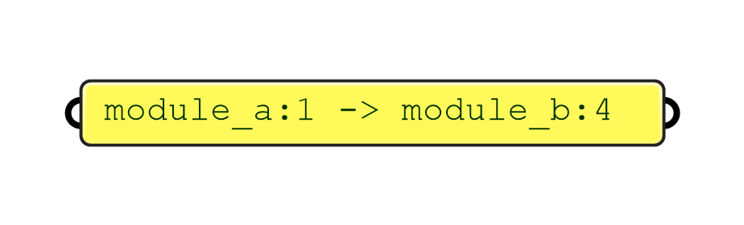
[Download](./examples/explicit-rule-from-a-literal/explicit-rule-from-a-literal.gh)

#### 11.2.2. Definition: Explicit Rule from components

[Download](./examples/explicit-rule-from-components/explicit-rule-from-components.gh)

#### 11.2.3. Definition: Explicit Rule from curve

[Download](./examples/explicit-rule-from-curve/explicit-rule-from-curve.gh)

### 11.3. Typed Rules

[Monoceros WFC Solver](#1041-monoceros-wfc-solver),
[Unwrap Typed Rules](#1037-unwrap-typed-rules) and
[Collect Rules](#1038-collect-rules) generate
[Explicit Rules](#831-explicit-rule) for all opposing Module Connectors marked
with the same connection Type in the set of [Typed Rules](#832-typed-rule).

A Typed Rule is valid if it refers to an existing Module and its Connectors. The
validity check is only performed in components that require both, Modules and
Rules as an input. Invalid Rules are being omitted.

Typed Rules can be constructed from a literal (Grasshopper text Panel), from its
components (name, Connector Index, connection Type) using
[Construct Typed Rule](#1034-construct-typed-rule), from a Point tag (point
inside the geometry of a Connector) using
[Typed Rule from Point](#10310-typed-rule-from-point) or with
[shortcut components](#114-indifferent-rules)
[Indifferent Rule from Point](#10312-indifferent-rule-from-point) and
[Indifferent Rule for unused Connectors](#10313-indifferent-rules-for-unused-connectors).
The second output of the [Construct Empty Module](#1022-construct-empty-module)
component is also a list of [Typed (Indifferent) Rules](#1110-empty-module).

*Note: It is possible to use [Module type data as Module Name](#828-module-casts).*

#### 11.3.1. Definition: Typed Rule from a literal

[Download](./examples/typed-rule-from-a-literal/typed-rule-from-a-literal.gh)

#### 11.3.2. Definition: Typed Rule from components

[Download](./examples/typed-rule-from-components/typed-rule-from-components.gh)

#### 11.3.3. Definition: Typed Rule from components using Module as Name

[Download](./examples/typed-rule-from-components-using-module-as-name/typed-rule-from-components-using-module-as-name.gh)

#### 11.3.4. Definition: Typed Rule from Point tag

[Download](./examples/typed-rule-from-point-tag/typed-rule-from-point-tag.gh)
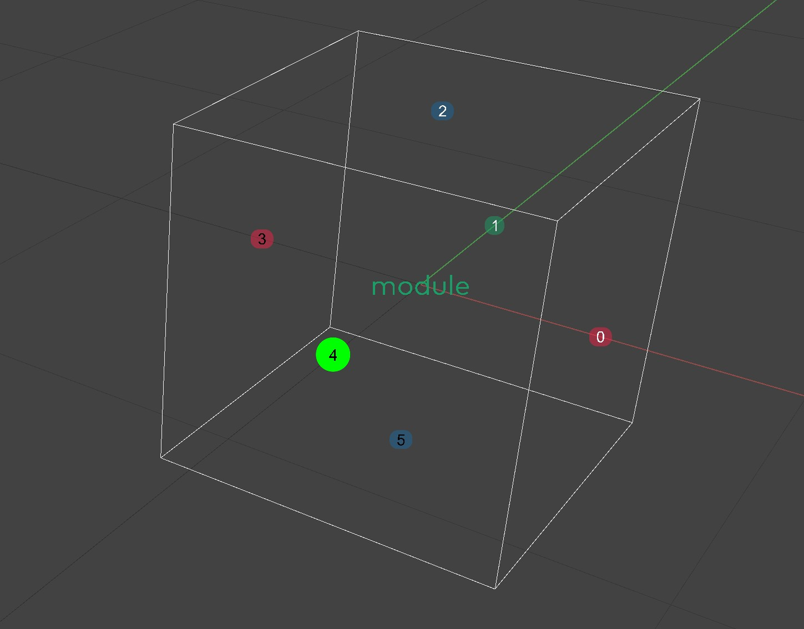

### 11.4. Indifferent Rules

Indifferent Rules are ordinary Typed Rules with a predefined Type `indifferent`.
It is a reserved Type because the [Out](#826-special-modules-out-and-empty) and
[Empty](#826-special-modules-out-and-empty) Modules have all connectors
automatically described with Indifferent Typed Rules (in case of Empty Module,
the Rules need to be added manually to the Rule set). Any Connector described
with the Indifferent Rule can connect to any opposite Connector described by an
Indifferent Rule. This is mostly used for those Connectors that represent
geometrical back or side (do not have a physical connector) of a Module and the
user does not have any specific intention with them. Indifferent Connectors can
be placed on the boundary of the
[Envelope](#813-automatic-envelope-wrapping)because the Out Module has all 6
Connectors described as Indifferent.

The Monoceros WFC Solver requires each Module Connector to be described by at
least one Rule and the Indifferent Rule is a good option for those Connectors
that do not have any other purpose.

**A connector can be described as indifferent even if it is described by another
Explicit or Typed Rule.** In most cases, only the unused Connectors are being
described as Indifferent. There are several ways of constructing Indifferent
Rules for unused Connectors.

For the [Monoceros WFC Solver](#1041-monoceros-wfc-solver) component you need to
[Collect](#1038-collect-rules) or simply Merge all Rules - the manually assigned
ones with the [generated Indifferent](#115-indifferent-rules) and Rules coming
along with the [Empty Module](#1022-construct-empty-module).

#### 11.4.1. Definition: Indifferent Rules for unused Connectors

#### 11.4.2. Definition: Indifferent Rules manual assignment

#### 11.4.3. Definition: Indifferent Rules literal assignment

### 11.5. Defining more Modules at once

#### 11.5.1. Pseudo code: (almost) without data trees

- construct Slots
- construct each Module individually with one or more Geometry
- define Explicit Rules from Curves
- define Indifferent Rules for unused Connectors
- merge and flatten all Rules
- run Monoceros WFC Solver
- Materialize the result

#### 11.5.2. Definition: (almost) without data trees

#### 11.5.3. Pseudo code: with data trees

- construct Slots
- graft list of Module names so that each name ends up in a separate branch
- merge Module Part Points and graft so that each Point ends up in a separate
  branch (if a Module consists of multiple Parts, process the Points like the
  Geometry in the following steps)
- if one or more Modules should contain more Geometry items, group each Geometry
  items belonging to each Module (do this also for single Geometry items), then
  merge to get a list of groups and ungroup so that each list of Geometries ends
  up in a separate branch
- construct Modules at once using the parallel data trees of Names, Points and
  Geometries
- flatten the list of Modules
- define Explicit Rules from Curves
- define Indifferent Rules for unused Connectors
- merge and flatten all Rules
- run Monoceros WFC Solver
- Materialize the result

#### 11.5.4. Definition: with data trees

#### 11.5.5. Result

### 11.6. Slots and Module Parts with non-uniforms dimensions

If the Module geometry does not naturally fit into cubic grid, it is possible to
define a non-uniform grid for Module Parts as well as for the Slots. The
dimensions of Part and Slot are defined as a Vector representing a diagonal of
the basic grid unit. The axial dimensions of the Vector are aligned with the
Module's or Slot's Base Plane.

The Diagonal also defines the discrete step of the world, in which the Modules
and Slots reside. Therefore components
[Construct Module](#1021-construct-module),
[Construct Slot with all Modules allowed](#1011-construct-slot-with-all-modules-allowed),
[Construct Slot with listed Modules allowed](#1012-construct-slot-with-listed-modules-allowed)
and [Slice Geometry](#1061-slice-geometry) consider the defined Base Plane as
the world origin and orientation and the Diagonal as the basic unit, into which
they should slice the WFC data.

**All Modules and Slots used in one solution must have identical Diagonal dimensions!**

#### 11.6.1. Definition

#### 11.6.2. Result

### 11.7. Modules and Envelope with individual base planes

A Base Plane defines element's (Module or Slot) coordinate system origin and
orientation. All their coordinates and directions will be measured from the Base
Plane.

During [Materialization](#1051-materialize-slots) of the solution, the Module
[Geometry](#823-module-geometry) will be oriented from the Module Parts' Pivots
(planes in the center of Module Parts aligned to the Module's Base Plane) to the
respective Slot's Pivot (plane in the center of the Slot aligned to the common
Base Plane of all Slots).

Even though in Monoceros it is possible to set individual Base Planes for each
element, **all [Slots](#81-slot) entering the
[Monoceros WFC Solver](#1041-monoceros-wfc-solver) must share an identical Base
Plane**. The [Modules](#82-module) can have individual Base Planes that do not
need to be identical across the solution.

### 11.8. Disallowing Rules

The [Monoceros WFC Solver](#1041-monoceros-wfc-solver) only works with allowed
Rules, however sometimes it may be useful to disallow certain connection. This
is especially useful when [Typed](#832-typed-rule) or
[Indifferent](#833-indifferent-typed-rule) Rules are being used. Such rules
[unwrap](#1037-unwrap-typed-rules) into one or more
[Explicit Rules](#1039-explicit-rule-from-curve), out of which some may be
unwanted. In such case it is possible to **remove the unwanted Rules from the
rule set using the [Collect Rules](#1038-collect-rules) component** and
effectively disallowing them. If a Rule is not present in the collection of
allowed Rules, it is not necessary to manually disallow it.

To disallow a Rule, it first needs to be created. Only then it is decided,
whether the Rule will be allowed or disallowed:

- If a Rule should be allowed, it may be passed directly into the Monoceros WFC
  Solver or into the Allowed Rules input (and must not be passed into the
  Disallowed Rules input) of the Collect Rules component.
- If a Rule should be disallowed, it cannot be listed in the Rule set passed
  directly into the Monoceros WFC Solver. To ensure its removal from the list of
  allowed Rules, it should be passed into the Disallowed Rules input of the
  Collect Rules component, while all allowed Rules are being passed into the
  Allowed Rules input. The Collect Rules component first unwraps and validates
  all allowed and disallowed Rules and then removes (if present) the disallowed
  Rules from the list of allowed Rules.

Both, Explicit and Typed Rules can be disallowed. The Collect Rules component
can be used repeatedly but in most cases it is enough to use it right before
passing the Rules into the Monoceros WFC Solver because at hat time the list of
all allowed Rules should be already complete.

**The output of the Collect Rules component completely replaces any previous
Rule set and should not be merged with any previous lists of Rules.**

**The Monoceros WFC Solver requires all Module Connectors to be described by at
least one Rule. Disallowing Rules may result in removing all Rules for certain
Connectors, which makes the solution impossible. In such case the Monoceros WFC
Solver throws an error.**

*Note: The Collect Rules component automatically unwraps Typed Rules and adds
Rules for [Out](#826-special-modules-out-and-empty) Modules.*

#### 11.8.1. Definition

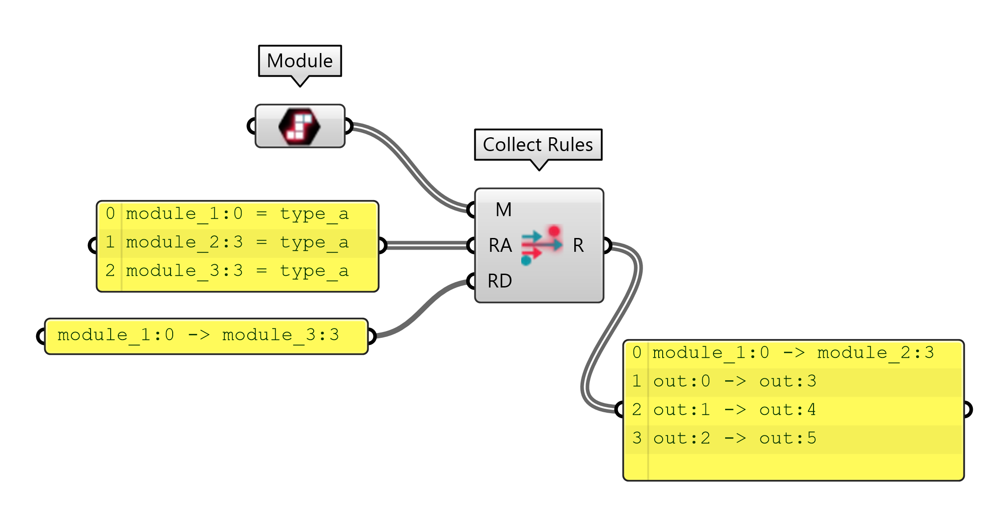
[Download](./examples/disallowing-rules/disallowing-rules.gh)

Allowed Rules
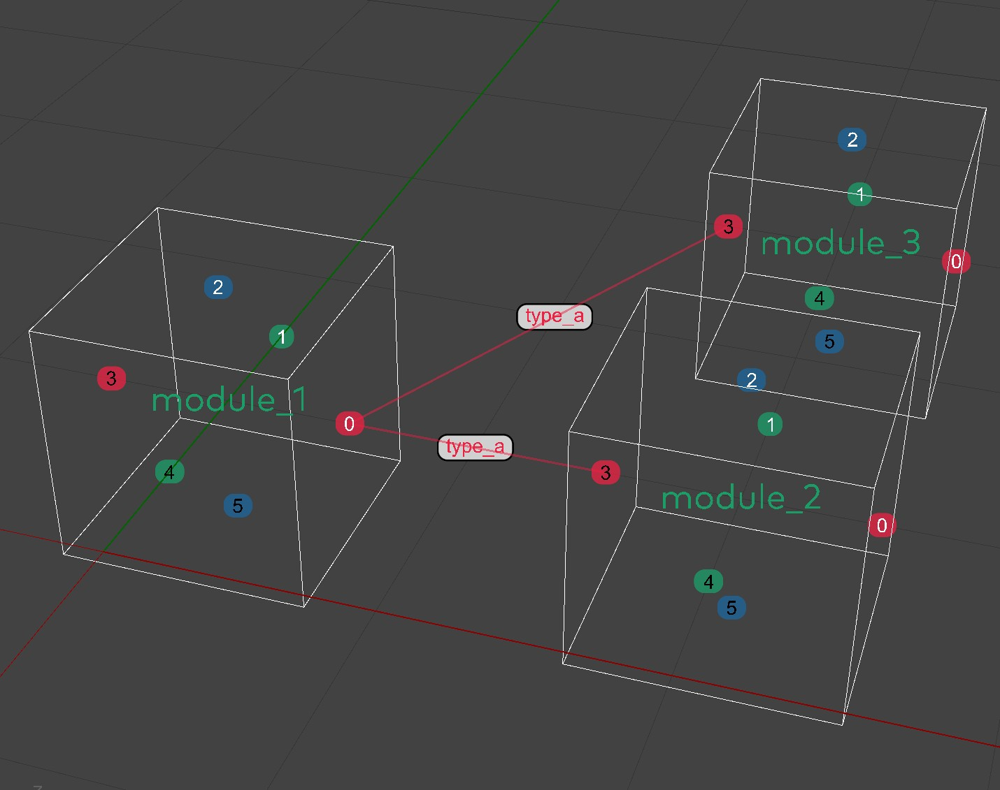
Disallowed Rules
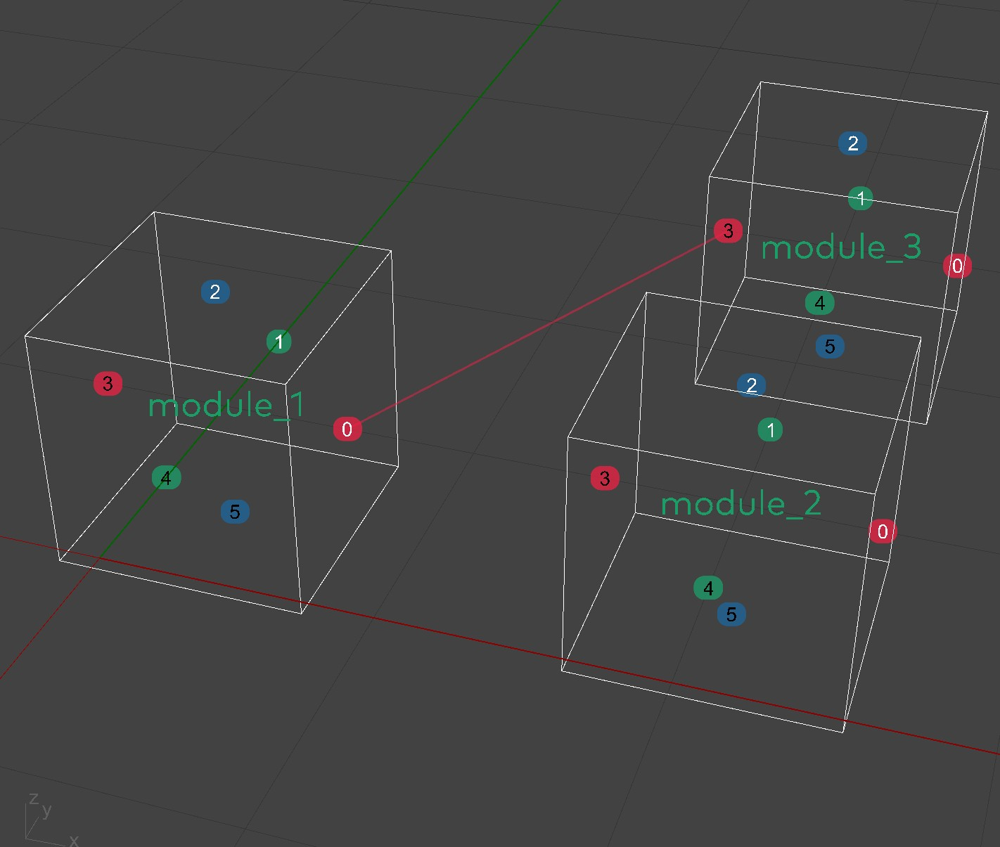
Resulting Rules
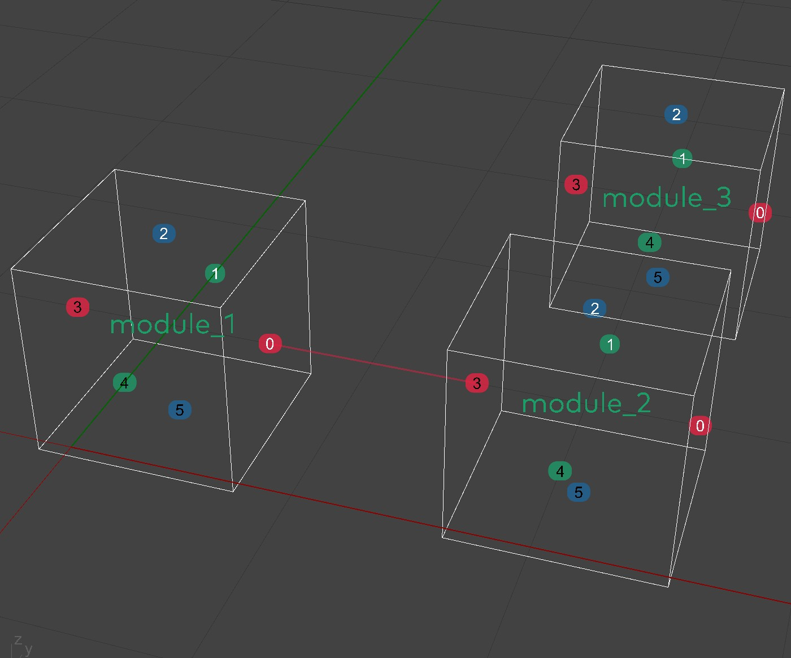

### 11.9. Modules with more Parts

A [Module](#82-module) can consist of more [Parts](#821-monoceros-module-parts)
which always hold together in [Materialized](#1051-materialize-slots) result of
the [Monoceros WFC Solver](#1041-monoceros-wfc-solver). Each Part should occupy
one [Slot](#81-slot) of the world [Envelope](#813-automatic-envelope-wrapping).
The [Construct Module](#1021-construct-module) component requires a list of
Module Part Points inside the created Module Parts.

Potential Module Parts are boxes of a size specified as
[Diagonal](#825-module-properties) filling the entire world, starting with a
Part which has its center at the world origin defined by the Module's
[Base Plane](#825-module-properties), aligned to match the Base Plane
orientation. Those **potential Parts, which contain one or more
[Module Part Points](#1021-construct-module) will become Parts** of the created
Module. It means, that even more Points may mark a single Module Part and
therefore the **Points do not have to be deduplicated**.

The Module Parts and therefore also the Module Part **Points do not need to
match the [Module Geometry](#823-module-geometry)**. In many cases the Module
Geometry extends, occupies only some Module Parts or does not exist at all.

Module Part Points can be created manually, come from manually populated input
geometry or from [Slice Geometry](#1061-slice-geometry) component. It is recommended
to **create the Module Part Points manually whenever possible** because it is
the conscious way, whereas the Slice Geometry component is a brute force
approach with
[many limitations](#1128-why-does-the-slice-geometry-component-give-invalid-results)
and potentially inconsistent results.

It is recommended to **keep the number of Module Parts meaningfully low**. Too many
Parts result in slow performance of the Monoceros WFC Solver and lower
probability of finding a valid solution. The current version of the Monoceros
WFC Solver also only **supports solutions with maximum of 256 Parts** from all
Modules together. If this number is exceeded with a single Module, the Module is
marked Invalid an the user gets notified by the
[Constructor](#1021-construct-module) and by all components and floating
parameters receiving the invalid Module. If this number is exceeded only when
all Modules are passed into the Monoceros WFC Solver, the user gets notified by
the Solver component.

#### 11.9.1. Definition: Module Part Points created manually

[Download](./examples/module-part-points-created-manually/module-part-points-created-manually.gh)
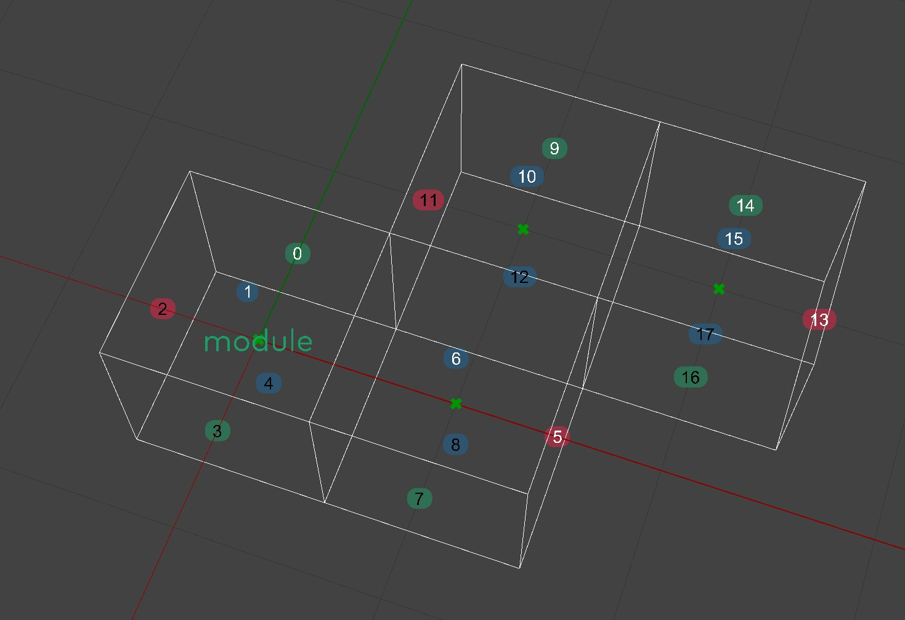

#### 11.9.2. Definition: Module Part Points created manually from geometry

[Download](./examples/module-part-points-created-manually-from-geometry/module-part-points-created-manually-from-geometry.gh)
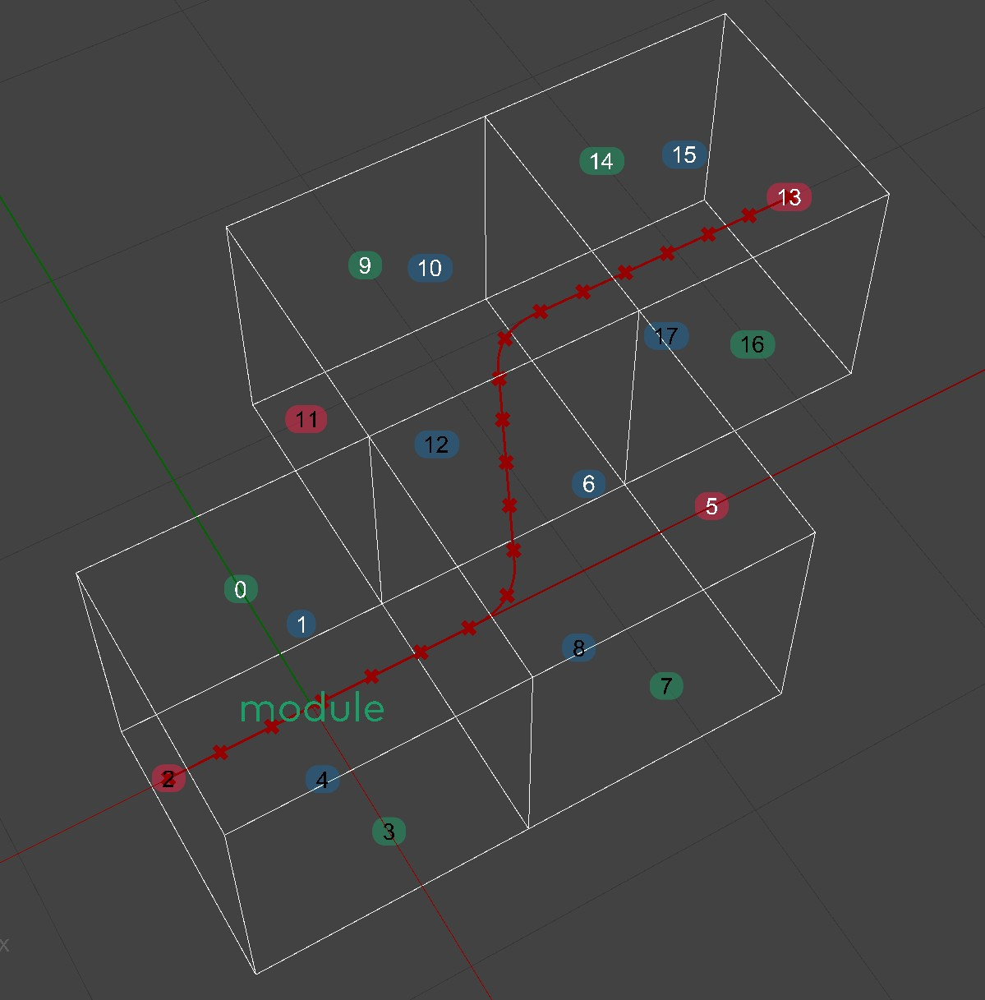

#### 11.9.3. Definition: Module Part Points created with Slice Geometry

[Download](./examples/module-part-points-created-with-slice-geometry/module-part-points-created-with-slice-geometry.gh)

### 11.10. Empty Module and allowing an Empty neighbor

If the Modules consist of more [Module Parts](#821-monoceros-module-parts) it is
often possible that the [Modules](#82-module) cannot be stacked together without
leaving blank [Slots](#81-slot), which is considered a
[contradictory](#5-wave-function-collapse) and therefore invalid result.

Monoceros therefore introduces a convenient
[Empty Module](#826-special-modules-out-and-empty)
[constructor](#1022-construct-empty-module). It is a shortcut for creating a
Module named `empty` with a single [Part](#821-monoceros-module-parts), with no
[Geometry](#823-module-geometry) and all [Connectors](#822-connectors) described
as [Indifferent](#833-indifferent-typed-rule). Since the name `empty` of the
default Empty Module cannot be changed, only one Empty Module can be used for a
solution.

*Note: An Empty Module with a different name can be also constructed manually,
which in some cases may be useful, when more types of empty Modules are
required.*

The Rules generated by the Empty Module constructor component need to be added
to the Rule set.

An Empty Module does have a geometrical representation and does appear in the
Rhinoceros viewport just like any other Module. Its helper geometry (cage and
Connector anchor points) can be baked and used to define additional Rules
involving the Empty Module, i.e. an Explicit Rule allowing adjacency of the
Empty Module to a specific (non-indifferent) Connector or a Typed Rule.

*Note: It is recommended to construct the Empty Module with a Base Plane shifted
away from the world XY origin because in most cases there already is a custom
module at {0,0,0} coordinate. If the Module inputs overlap, the Rules from
Points or Curves may be mixed.*

#### 11.10.1. Definition: Empty Module and additional Explicit Rules

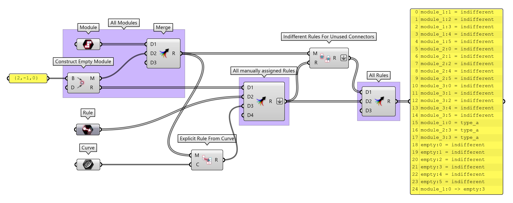
[Download](./examples/empty-module-and-additional-explicit-rules/empty-module-and-additional-explicit-rules.gh)

#### 11.10.2. Definition: Explicit Rules with all Connectors of Empty

It is convenient to try to generate Explicit Rules from Curve from the desired
Connectors to all six Connectors of the Empty Module. The
[Explicit Rule from Curve](#1039-explicit-rule-from-curve) component, the
[Monoceros WFC Solver](#1041-monoceros-wfc-solver) or other components will
remove the invalid Rules that connect non-opposite Connectors and only keep the
valid ones.

*Note: This strategy can be applied onto any collection of Modules, not only
onto the Empty Module.*

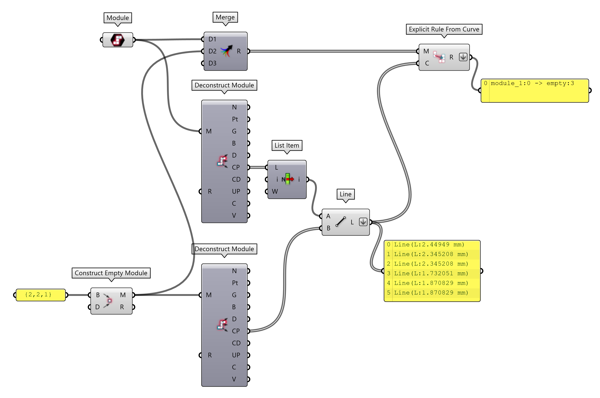
[Download](./examples/explicit-rules-with-all-connectors-of-empty/explicit-rules-with-all-connectors-of-empty.gh)
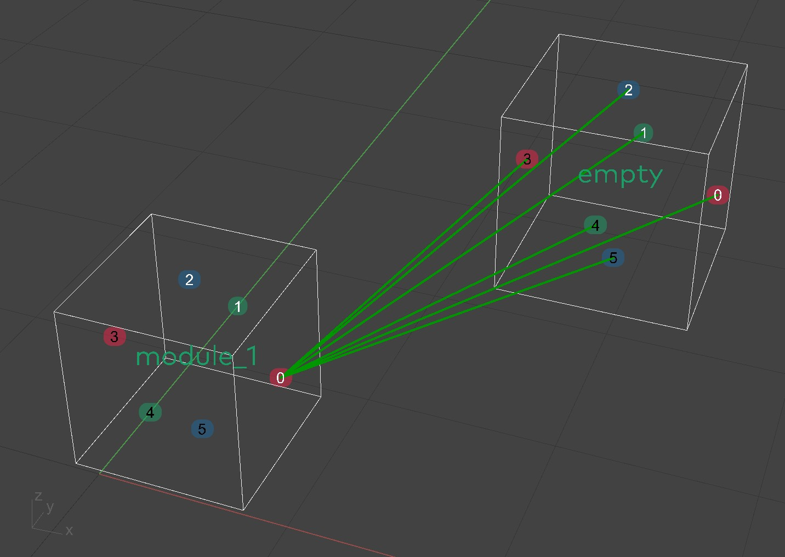

#### 11.10.3. Definition: Multiple different Empty Modules

If the Empty Module should be larger than a single Part, it is convenient to
generate custom Modules with no geometry with the required properties and allow
them to be adjacent to the Modules that require more Empty space next to them.

*Note: The Empty Module is often a way to make the setup valid. Replacing it
with a custom empty module with multiple Parts may make the setup unsolvable.*

[Download](./examples/multiple-different-empty-modules/multiple-different-empty-modules.gh)
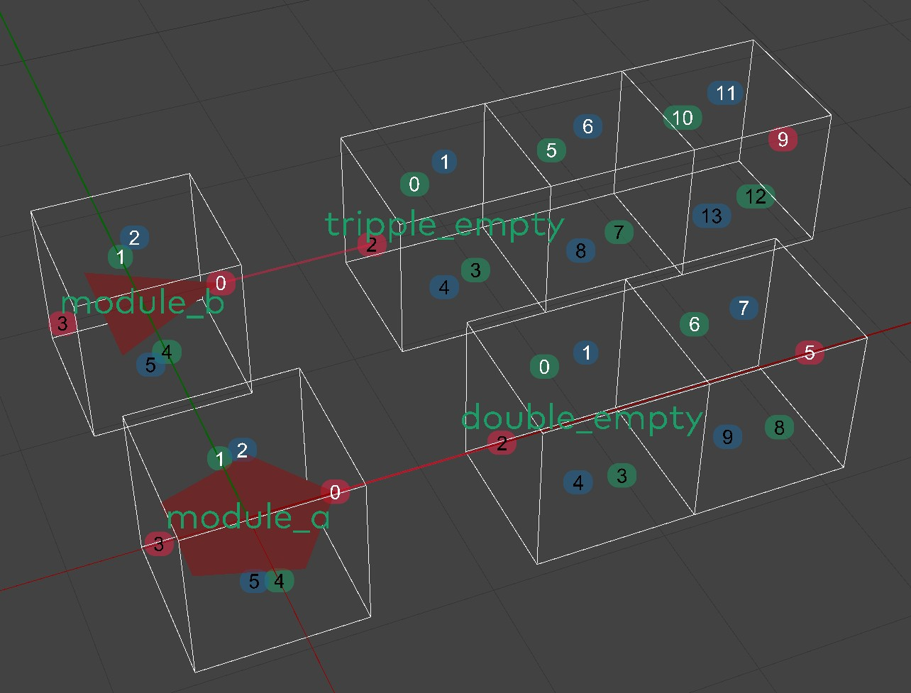

### 11.11. Allowing Modules to be at the boundary of the Envelope

The Envelope [Slots](#81-slot) are
[automatically wrapped](#813-automatic-envelope-wrapping) into a layer of Slots
containing exclusively an `out` Module. It is being generated
[implicitly automatically](#826-special-modules-out-and-empty) in the
[Monoceros WFC Solver](#1041-monoceros-wfc-solver) component and in
[Unwrap Typed Rules](#1037-unwrap-typed-rules) and
[Collect Rules](#1038-collect-rules) components. The Out Module has one Part and
automatically comes with all 6 connectors described as
[Indifferent](#833-indifferent-typed-rule).

This way the [Out Module](#826-special-modules-out-and-empty) can be adjacent to
itself and to all Indifferent [Connectors](#822-connectors). That means that all
Modules with Indifferent Connectors can be at the boundary of the Envelope
because their Indifferent Connectors can be adjacent to the Out Module, which is
certainly placed outside of the Envelope.

Some sets of Modules and Rule sets, however, require additional way of allowing
some Modules to be at the boundary of the Envelope. THis typically happens when
the Modules create an open linear (i.e. pipes) or a branching (i.e. growing
tree) structure. Ins such case a Module that can appear in the middle of an
assembly, should be also able to appear at its beginning and end - at the
boundary of the Envelope. Such Module's Connector should not be described as
Indifferent because then it could appear next to any other Indifferent
Connector, which would break the structure of the aggregate. For such cases
there is [Rule at boundary from Point](#10311-rule-at-boundary-from-point)
component, which creates an Explicit Rule, allowing adjacency of a Connector
tagged with the input Point and an opposite Out Module's Connector. This is the
most convenient way of creating such Rule because there is no need to specify
the correct opposite Connector of the Out Module.

*Note: The Out Module module does not have any geometrical representation in the
Rhinoceros viewport and therefore it is impossible to create an Explicit Rule
from Curve with it.*

It is also possible to disallow certain Indifferent Module Connectors from
appearing at the boundary of the Envelope by generating respective rules with
the Rule at boundary from Point component and disallow them using the
[Collect Rules](#1038-collect-rules) component.

#### 11.11.1. Definition

[Download](./examples/allowing-modules-to-be-at-the-boundary-of-the-envelope/allowing-modules-to-be-at-the-boundary-of-the-envelope.gh)

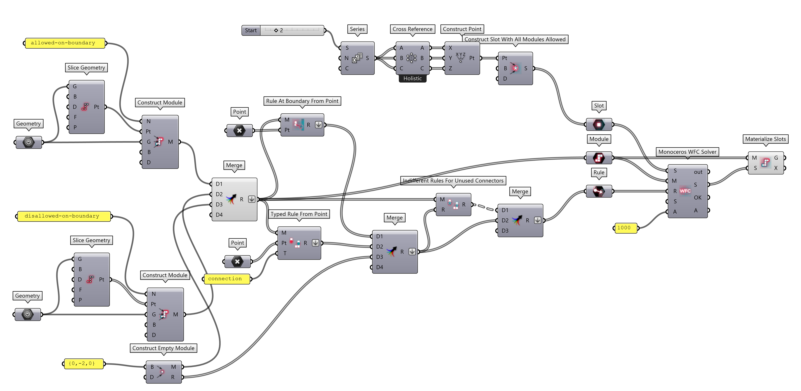
[Download](./examples/allowing-modules-to-be-at-the-boundary-of-the-envelope/allowing-modules-to-be-at-the-boundary-of-the-envelope.gh)
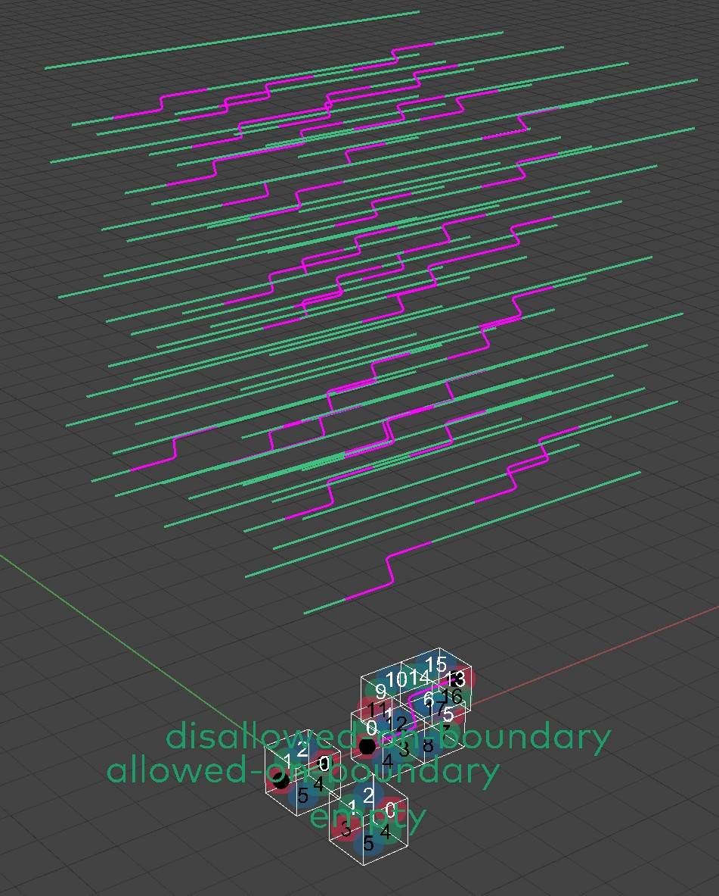

### 11.12. Constructing Slots

Monoceros [Slots](#81-slot) are cuboid (box-like) chunks of space, delimiting a
single basic discrete gid unit, which can contain certain
[Module Part](#821-monoceros-module-parts). A flat list of Slots forms an
[Envelope](#813-automatic-envelope-wrapping). The Envelope can have any shape,
be full or hollow, one, two or three-dimensional, form a single or multiple
blobs.

Each individual Slot is created by defining (any) point inside the respective
chunk of space delimited by the potential Slot. Each input point generates one
Slot, therefore
[duplicate input points](#1114-preventing-duplicate-slots-from-points) create
duplicate Slots.

Slot input points can be constructed either manually, manually from geometry,
using the [Slice Geometry](#1061-slice-geometry) component or employing a
combination of these methods. It is recommended to **generate the input points
manually or manually from geometry whenever possible** because it offers better
control. The Slice Geometry component is a brute force approach with
[many limitations](#1128-why-does-the-slice-geometry-component-give-invalid-results)
and potentially inconsistent results.

#### 11.12.1. Definition: Slots from manually generated points

#### 11.12.2. Definition: Slots from manually generated points from geometry

#### 11.12.3. Definition: Slots from Slice Geometry: Points

#### 11.12.4. Definition: Slots from Slice Geometry: Curves

#### 11.12.5. Definition: Slots from Slice Geometry: Surfaces

#### 11.12.6. Definition: Slots from Slice Geometry: Mesh and Brep volumes

#### 11.12.7. Definition: Slots from Slice Geometry: Miscellaneous geometry

### 11.13. Preventing duplicate Slots from points

Monoceros [Slots](#81-slot) are constructed via components
[Construct Slot with all Modules allowed](#1011-construct-slot-with-all-modules-allowed)
or
[Construct Slot with listed Modules allowed](#1012-construct-slot-with-listed-modules-allowed)
per single Slot. That means each input point generates one Slot even if a Slot
at that discrete grid position already exists. That will not only result in too
many Slots but also cause an error of the
[Monoceros WFC Solver](#1041-monoceros-wfc-solver). To prevent that, the input
points need to be properly deduplicated, so that each Slot is marked by a single
point, located unambiguously inside the Slot.

This can be done manually, but more conveniently it is possible to use the
[Slice Geometry](#1061-slice-geometry) component to process the input collection
of points into a list of distinct Slot centers.

#### 11.13.1. Definition

### 11.14. Allowing certain Modules in certain Slots

[Slots](#81-slot) are distinct discrete cuboid chunks of space, that allow
placement of certain ][Module](#82-module) or their
[Parts](#821-monoceros-module-parts) into the respective portion of space.

In the initial state of the solution, the Slots can either allow placement of
[any Module or its Part](#1011-construct-slot-with-all-modules-allowed) or a
specified [list of Modules](#1012-construct-slot-with-listed-modules-allowed).
The latter is especially useful if certain areas of the Envelope should or
should not contain certain Modules. The list of allowed Modules needs to be
specified manually for each Slot, but this can be effectively achieved with the
existing Grasshopper tools.

#### 11.14.1. Definition: Allowing Modules modules in certain area

#### 11.14.2. Definition: Disallowing Modules modules in certain area

#### 11.14.3. Definition: Allowing Modules modules based on attractor

#### 11.14.4. Roulette approach to weighted probability

The Slots do not allow weighted probability of placing certain Modules but the
weight can be simulated and distributed discretely. That means, allowing
placement of a certain Module will be allowed in Slots more or less often in
Slots of certain area. For each individual Slots there will have to be a
decision to be made, whether it should or should not allow placement of a Module
based on the probability factor.

Technically, this can be achieved by a roulette method: a random item will be
chosen from a list of possibilities but the items will be multiplied in the list
based on their probability.

#### 11.14.5. Definition: Roulette - Choosing a binary weighted option

For example, the algorithm should choose from two options `a` and `b`, with
probability `3:2` in favour of option `a`, the list of options will contain
items `a, a, a, b, b`, out of which one random option will be chosen.

#### 11.14.6. Definition: Roulette - Choosing one weighted option from multiple choices

For more items, the probability can defined as a number from range `0.0 to 1.0`
with probabilities `a=0.3`, `b=0.1`, `c=0.8`, then the list of items will
contain `a, a, a, b, c, c, c, c, c, c, c, c`, out of which one random item will
be chosen.

#### 11.14.7. Definition: Roulette - Choosing more weighted options from multiple choices

It the random weighted selection expects results with more items, it is possible
to use the same strategy. The
[previous example](#11155-definition-roulette---choosing-a-binary-weighted-option)
could describe a Slot, that can contain `3` Modules, witch probabilities
`a=0.3`, `b=0.1`, `c=0.8`. The list of items will be extended to
`a, a, a, b, c, c, c, c, c, c, c, c` and randomly reduced back to `3` options.
Such result will most probably contain `c, c, c`, which then will be
deduplicated to `c` or `a, c, c` deduplicated to `a, c`. This way it is possible
to keep only the most probable modules in a Slot.

#### 11.14.8. Definition: Allowing Modules based on vertical gradient

Employing the
[roulette](#11157-definition-roulette---choosing-more-weighted-options-from-multiple-choices)
approach, it is possible to use gradient values calculated from vertical
position to a probability of Module placement.

#### 11.14.9. Definition: Allowing Modules based on multiple attractor gradients

Employing the
[roulette](#11157-definition-roulette---choosing-more-weighted-options-from-multiple-choices)
approach, it is possible to use gradient values calculated from distance of an
attractor to a probability of Module placement.

### 11.15. Fixing Modules in Envelope before running the Solver

In certain cases it is desired to place certain [Modules](#82-module) into
certain [Slots](#81-slot) even before running the
[Monoceros WFC Solver](#9-monoceros-wfc-solver). The solution will then respect
the position of such placed Modules and the rest of the solution will follow
according to the given [Rule](#83-rule) set.

In Monoceros it is possible to achieve this by constructing the respective Slots
with the list of Allowed Modules containing only the desired Module. If the
Module consists of more [Parts](#821-monoceros-module-parts) it is sufficient to
construct a single Slot with the list of allowed Modules containing exclusively
the desired Module. Monoceros will place one of the Module Parts into the Slot
and the rest into the adjacent Slots as long as they are allowed to be place
there, too.

*Note: Due to the way [Monoceros](#9-monoceros-wfc-solver) exposes the vanilla
[Wave Function Collapse](#5-wave-function-collapse) algorithm, it is not
possible to place a Module into an exact position. The
[Monoceros WFC Solver](#9-monoceros-wfc-solver) picks any Module Part to be
placed into a Slot allowing placement of the Module.*

*Note: Placing Modules manually may cause longer search for a valid solution or
completely unable an existence of a valid solution.*

### 11.16. Disallowing certain Modules from certain Slots

Similarly to
[allowing](#1116-fixing-modules-in-envelope-before-running-the-solver) certain
[Modules](#82-module) to be placed into certain [Slots](#81-slot), it is
possible to disallow placement of certain Modules into certain Slots.

Because Monoceros does not recognize disallowing, it is necessary to remove the
disallowed Module name from the list of allowed modules for the respective
Slots. For newly created Slots the list of allowed Modules should be prepared
manually. Existing Slots can be [deconstructed](#1013-deconstruct-slot) and
reconstructed with a reduced list of allowed Modules. The original Slots should
be replaced with the reconstructed ones.

#### 11.16.1. Definition: Disallowing Modules in new Slots

#### 11.16.2. Definition: Disallowing Modules in existing Slots

### 11.17. Enforcing specific modules at the boundary of the Envelope

If specific [Modules](#82-module) are
[allowed to be placed at the boundary of the Envelope](#1111-allowing-modules-to-be-at-the-boundary-of-the-envelope)
but their placement should be enforced, it is possible to identify
[Slots](#81-slot) at the boundary of the
[Envelope](#813-automatic-envelope-wrapping) using the
[Are Slots Boundary](#1014-are-slots-boundary) component,
[deconstructing](#1013-deconstruct-slot) the boundary Slots and
[allowing](#1114-allowing-certain-modules-in-certain-slots) or
[disallowing](#1116-disallowing-certain-modules-from-certain-slots) the desired
Modules from these Slots.

#### 11.17.1. Definition

#### 11.17.2. Definition: Identifying more boundary layers

If more than one boundary layer of [Slots](#81-slot) should be isolated, the
[Are Slots Boundary](#1014-are-slots-boundary) component can be used multiple
times, each time on Slots identified as inner (non-boundary).

### 11.18. Growing the boundary of the Envelope

It is possible to wrap the existing
[Envelope](#813-automatic-envelope-wrapping) of [Slots](#81-slot) into another
layer of Slots. The [Add Boundary Layer](#1015-add-boundary-layer) component
generates a collection of [Slot center points](#812-slot-properties) that can be
converted into Slots, which will form a single added layer to the existing
Envelope.

#### 11.18.1. Definition

### 11.19. Materializing results

A correct result of the [Monoceros WFC Solver](#9-monoceros-wfc-solver) is a
collection of deterministic [Slots](#81-slot), which allow exactly one
[Module Part](#821-monoceros-module-parts) to be placed. This is still not the
final stage of the discrete assembly process because the solution is not yet
[Materialized](#1051-materialize-slots), which is a process of placing
[Module Geometry](#823-module-geometry) into its respective Slots.

The output of [Materialize Slots](#1051-materialize-slots) component is a data
tree with paths `{ module index, slot index }`, where `module index` is the
order of the placed Module in the input list of Modules and `slot index` is the
order of the target Slot in the input list of Slots. Each branch then contains
all geometry items of the respective Module.

*Note: Due to the way Monoceros treats Module Parts, only the first Part of each
Module is placed into its Slot, leaving the remaining Slots containing the
Module empty (their index will not even appear in the Materialize Slots
component output data tree).*

The geometry output of the Materialize Slots component is intended for further
use in Grasshopper. Therefore, if the intention is to bake the output of the WFC
already in this stage, it is recommended to bake the Materialize Slots component.
The result of such bake is a
[collection of block instances](#128-are-block-instances-or-groups-supported-by-monoceros),
which are significantly smaller than full-fledged geometry and all blocks of one
type can be edited at once.

*Note: The viewport rendering of materialized geometry may be slow on some
computers. This makes the Materialize Slots component one of the slowest part of
a Grasshopper Monoceros definition. To speed it up, it is recommended to disable
preview of the Materialize Slots component prior to connecting wires to its
inputs.*

#### 11.19.1. Definition

### 11.20. Proto-results and custom materialization

In some cases the final geometry of a Grasshopper definition does not have to be
[the one stored](#823-module-geometry) in the Monoceros [Modules](#82-module).
The Modules can contain some proto=geometry instead and the final geometry is
then constructed in Grasshopper after
[materialization](#1051-materialize-slots).

A typical case may be structures that are not meant to be discrete, but rather
continuous. The Modules should then contain only the skeleton of such structure,
which will be joined and wrapped into volumes after the materialization of the
WFC assembly.

#### 11.20.1. Definition

### 11.21. Using the transform data to materialize the result

In very special cases, the geometry does not have to enter the
[Modules](#82-module) at all. Instead, the
[Monoceros WFC Solver](#9-monoceros-wfc-solver) runs on the [Rule](#83-rule) set
an Modules with no [geometry](#823-module-geometry) and so does the
[Materialize Slots](#1051-materialize-slots) component. Its `Transform` output
contains transformation data, that can be used to place any geometry from the
original Module location into all the [Slots](#81-slot) which should contain the
respective geometry.

This is especially useful if there are various geometry sets that could be used
as the Module Geometry. These sets can be interchanged without the need of
recalculating the entire Monoceros WFC solution.

*Note: The geometry that should be placed using the `Transform` output needs to
be located and aligned properly: it should share the same location and Base
Plane orientation with the original Module.*

#### 11.21.1. Definition

### 11.22. Random seed and attempts count

During the [Wave Function Collapse](#5-wave-function-collapse) calculation,
there are several moments when a random decision has to be made: if a
[Slot](#81-slot) allows placement a equally valid [Modules](#82-module), the
[Monoceros WFC Solver](#9-monoceros-wfc-solver) chooses one random Module to be
placed. Such situation can occur at several Slots at a time, therefore the
Solver chooses a random Slot to process.

Like Grasshopper, also Monoceros uses seeded pseudo-random function. That means
that the **[Monoceros WFC Solver](#1041-monoceros-wfc-solver) generates the same
solution for a constant [Rule](#83-rule) set and constant Modules and Slots
every time and at every computer, as long as the seed is the same** and vice
versa, **different seeds generate different outputs** even on the same computer.

The WFC algorithm does not ensure there will always be a solution. Throughout
the processing it can happen that the setup may not result in a valid output -
some Slots may end up contradictory and allow placement of no Modules
whatsoever. Such situation cannot be anticipated rr prevented, therefore it is
necessary to make several attempts with different random decisions. The
[Monoceros WFC Solver](#1041-monoceros-wfc-solver) component lets the user to
define how many unsuccessful attempts should it make until it pronounces the
setting unsolvable.

**There is no good value for maximum attempts.** For simple and well defined
setups the Solver usually finds the solution in the first attempt but it is not
rare that it takes more than a thousand attempts to find a solution in some
cases. The mere fact that it requires **more than one attempt shows, that the
setup is problematic** and may not be solvable at all.

**There is no good value for the random seed.** Changing the random seed for
setups that produce solutions will result in various, yet equally good
solutions. The properties and qualities of a solution are not related to the
value of the random seed, therefore it makes no sense to compare one seed to
another. For solutions that are hard to find it may happen, that for some random
seeds the Solver requires less attempts than for others. This is only true until
other inputs (Modules, Rules and Slots) remain unchanged.

### 11.23. Visualizing Rules

The [Rules](#83-rule) can be
[displayed](#8313-explicit-rule-viewport-preview-and-baking) in Rhinoceros
viewport and baked using [Rule Preview](#1053-rule-preview) component. The Rule
is shown as a line, connecting two [Connectors](#822-connectors) that are
allowed to be adjacent.

The color of the preview line indicates the orientation of the Connectors: red
means X, green means Y and blue means Z. If the Rule allowing adjacency is
[Typed](#832-typed-rule), the line carries also a label with the Type name.

*Note: It is not always necessary to display all Rules or Rules for all
[Modules](#82-module). The inputs can vary depending on the information that
should be displayed.*

#### 11.23.1. Definition

### 11.24. Visualizing allowed Module couples

An [Explicit Rule](#83-rule) can be displayed also as an [assembly](#1052-assemble-rule)
of two [Modules](#82-module) that are allowed to be adjacent.

*Note: A [Typed Rule](#832-typed-rule) can be converted into a collection of
Explicit Rules prior to assembling.*

The Module mentioned in the [Rule](#83-rule) first is considered a source, the
second one a target. The source Module's [Pivot](#825-module-properties) is
aligned to the assembly Base Plane, the target Module is aligned to source
Module so that their adjacent [Connectors](#822-connectors) are touching.

*Note: The [Assemble Rule](#1052-assemble-rule) component does not check the two
modules for overlapping but the
[architecture of the WFC Solver](#5-wave-function-collapse) prevents the
overlaps in the actual solution.*

If more Rules should be assembled at once, it is necessary to define an
individual Base Plane for each assembly. The Base Planes need to be manually
distributed so that the assemblies do not overlap.

#### 11.24.1. Definition: Visualizing one Module couple

#### 11.24.2. Definition: Visualizing a catalog of Module couples

## 12. FAQ

### 12.1. What is a good exercise to start using Monoceros?

The Wave Function Collapse is a very powerful tool but requires a lot of
patience to learn. It is recommended to read the
[Subdigital WFC Book](https://issuu.com/subdigital/docs/wfc_book_pages) and
understand the principles of [WFC](#5-wave-function-collapse) and its
implementation in [Monoceros](#9-monoceros-wfc-solver) before trying the first
experiments in Grasshopper. It is especially important to understand that WFC is
not a growth algorithm and how does it differ from other seemingly similar
discrete assembly tools.

When learning Monoceros and building intuitive sensitivity, the following steps
are recommended:

1. Start as simple as possible
2. Do not jump to complex setups too early
3. Use a relatively small sphere to generate the
   [Envelope](#813-automatic-envelope-wrapping)
4. Try defining a single simple [Module](#82-module) - a vertical line
5. Generate [Indifferent Rules](#114-indifferent-rules) for all its
   [Connectors](#822-connectors)
6. Use the [Monoceros WFC Solver](#1041-monoceros-wfc-solver) and
   [Materialize Slots](#1051-materialize-slots) components to finish
   [the simplest assembly](#111-bare-minimum)
7. Define the first [Explicit Rule](#831-explicit-rule) allowing the Module to
   meaningfully connect to itself - bottom to the top or vice versa
8. Try to figure out why there is
   [no solution](#122-what-does-the-error-world-state-is-contradictory-mean)
9.
   [Allow the Module](#1111-allowing-modules-to-be-at-the-boundary-of-the-envelope)
   to be placed at the [Envelope boundary](#10311-rule-at-boundary-from-point)
10. Add [Empty Module](#1110-empty-module-and-allowing-an-empty-neighbor)
11. Add second Module - a horizontal line
12. Figure out why does it
    [not appear in the solution](#1111-allowing-modules-to-be-at-the-boundary-of-the-envelope)
13. Try removing the Empty Module
14. Add the third Module - an L shape that could connect the vertical and
    horizontal Module
15. Construct Explicit Rule that connects the L Module with the other two
    Modules
16. Try preventing the vertical and horizontal Modules to appear at the boundary
    and place the L Module there instead
17. Add the Empty Module again
18. Add an three other L shape Modules so that the Solver can generate closed
    rectangles
19. Try to [figure out](#10311-rule-at-boundary-from-point) why there are open
    shapes and prevent them
20. Try creating a Rule set that generates closed zig-zag shapes
21. Try replacing all Explicit Rules with [Typed Rules](#832-typed-rule)
22. Whenever hesitating, look for an answer in the [Examples](#11-examples).

### 12.2. What does the error "World state is contradictory" mean?

It means there is no potential solution for the current setup. It can have
several reasons:

- the [Module Parts](#821-monoceros-module-parts) form a shape that cannot be
  assembled without an [Empty Module](#1022-construct-empty-module)
- the [Envelope](#813-automatic-envelope-wrapping) or **its part** is too small
  to place any allowed [Module](#82-module)
- no Module is allowed to be
  [placed at the boundary](#1111-allowing-modules-to-be-at-the-boundary-of-the-envelope)
  because the required [Connectors](#822-connectors) are described by custom
  [Rules](#83-rule) and the [Indifferent Rules](#833-indifferent-typed-rule)
  were not
  [automatically generated](#1141-definition-indifferent-rules-for-unused-connectors)
  for them
- the [Rule set](#83-rule) does not allow for any viable assembly

### 12.3. Why the Solver cannot find any solution even after 1000 attempts?

Most probably because the [Rule set](#83-rule) is too specific and the solution
is rare. Try making the [Envelope](#813-automatic-envelope-wrapping)
significantly smaller without causing a a
[contradictory world state](#122-what-does-the-error-world-state-is-contradictory-mean)
and increase the number of attempts.

Try [changing the random seed](#1122-random-seed-and-attempts-count), even
though it only forces the [Monoceros WFC Solver](#9-monoceros-wfc-solver) to try
different random set of attempts.

If there is no solution even after 5000 attempts and several different random
seeds, it is recommended to start over and build up the setup
[Module](#82-module) by Module.

It is also possible that the setup has no solution at all.

### 12.4. What makes a good Module?

The safest [Module](#82-module) has only one
[Part](#821-monoceros-module-parts) but such Modules also generate unsurprising
and simple outputs. A Module can consist of
[maximum 256](#825-module-properties) Parts, but it is recommended to keep the
number of Module Parts under 10.

The Module has to be [consistent](#825-module-properties) and all its
[Connectors](#822-connectors) need to be described by at least one
[Rule](#83-rule), even if it should be an
[Indifferent Rule](#833-indifferent-typed-rule).

To achieve interesting results, the Module's content (in most cases its
[Geometry](#823-module-geometry)) should be semantically heterogenous or in
other words, the boundaries of semantical parts should not match the boundaries
of Modules. Said simply, the whole should be cut through the middle of a
distinct part, rather than along its boundary. If the Modules should represent
urban elements, they should not contain individual houses but rather a part of a
house, part of a garden, part of a pavement and a bit of a road. If the WFC
should compose a world map, **good Modules are those that contain a coast
line**, not those that contain only the sea or the land.

### 12.5. What makes a good Envelope?

A good [Envelope](#813-automatic-envelope-wrapping) is aware of the size and
shape of the [Modules](#82-module) that should be placed into it.

If the Modules do not [allow it](#124-what-makes-a-good-module), the Envelope
should not have small parts sticking out, forming
[thin shells](#11125-definition-slots-from-slice-geometry-surfaces) otherwise
already the inital state of the Envelope may be
[contradictory](#122-what-does-the-error-world-state-is-contradictory-mean).

### 12.6. Why does the Slice Geometry component give invalid results?

If the [sliced geometry](#1061-slice-geometry) or its part reaches the boundary,
edge or vertex of a potential [Slot](#81-slot) or a
[Module Part](#821-monoceros-module-parts), it means that the part may belong
into two (if on surface), four (if on edge) or even eight (if on vertex)
neighboring grid cells. It is difficult for the component to decide into which
one it should be placed. Any approach would be only approximating and could give
wrong results in edge cases.

Therefore the [Slice Geometry](#1061-slice-geometry) component completely
resigns on any decision making in unambiguous situations. Therefore it is
strongly recommended to generate [Slot Points](#1112-constructing-slots) and
[Module Part Points](#119-modules-with-more-parts) manually whenever possible.

### 12.7. How to set a Rule for a Module distant two or more Slots?

**It is not possible.** The
[Monoceros Wave Function Collapse implementation](#9-monoceros-wfc-solver)
allows to specify only [immediate adjacency](#83-rule).

For specific cases of 1D and 2D aggregates it is possible to use the remaining
dimension to specify [Modules](#82-module) with no
[Geometry](#823-module-geometry) spanning over more
[Parts](#821-monoceros-module-parts) / [Slots](#81-slot) with [Rules](#83-rule)
at [Connectors](#822-connectors) farther apart.

### 12.8. Are block instances or groups supported by Monoceros?

**No.** These data types are not part of the usual geometrical hierarchy in
Grasshopper.

[Construct Module](#1021-construct-module) and
[Slice Geometry](#1061-slice-geometry) components support the following geometry
types and their derivatives:

- Point
- Curve (and Line, Arc, Circle etc.)
- Surface (and Sphere etc.)
- Brep / Polysurface (and Box etc.)
- Mesh

The
[architecture of Monoceros](#7-architecture-of-monoceros-grasshopper-plug-in)
expects a small number of lightweight [Modules](#82-module). In such case it
should not be a performance problem to embed the
[geometry](#823-module-geometry) into the Modules. The geometry itself is not
being used for any calculations until the Modules reach the
[Materialize Slots](#1051-materialize-slots) component.

Two things are happening in the Materialize Slots component:

- it outputs the Module Geometry in a data tree. Each branch path represents
  `{ module index, slot index}`, where `module index` is the order in which the
  Modules were passed into the Materialize Slots component and `slot index` is
  the order in which the Slots were passed into the Materialize Slots component.
  Each branch contains a complete list of geometry brought by the respective
  Module into its Slot. *Note: Only the Slots containing the first
  [Part](#821-monoceros-module-parts) of each Module contain the Module Geometry
  to prevent duplicate geometry entries for multi-part Modules.* Displaying all
  materialized geometry in Rhinoceros viewport may be slow, therefore **it is
  recommenced to disable preview for the Materialize Slots component**. The
  output geometry may be used for further Grasshopper processing or evaluation.
- it bakes the module geometry as block instances. This means the geometry
  exists in Rhinoceros only once and all its instances are just references to
  the original block. This way it is possible to modify all instances of
  geometry of each Module type at once by modifying any of the blocks. In most
  cases it also means a significantly smaller Rhinoceros `.3dm` file.

## 13. Partners

Developed at [Subdigital](https://sub.digtial).

Supported using public funding by Slovak Arts Council.

## 14. MIT License

Copyright (c) 2021 Subdigital | Ján Pernecký, Ján Tóth

Permission is hereby granted, free of charge, to any person obtaining a copy of
this software and associated documentation files (the "Software"), to deal in
the Software without restriction, including without limitation the rights to
use, copy, modify, merge, publish, distribute, sublicense, and/or sell copies of
the Software, and to permit persons to whom the Software is furnished to do so,
subject to the following conditions:

The above copyright notice and this permission notice shall be included in all
copies or substantial portions of the Software.

THE SOFTWARE IS PROVIDED "AS IS", WITHOUT WARRANTY OF ANY KIND, EXPRESS OR
IMPLIED, INCLUDING BUT NOT LIMITED TO THE WARRANTIES OF MERCHANTABILITY, FITNESS
FOR A PARTICULAR PURPOSE AND NONINFRINGEMENT. IN NO EVENT SHALL THE AUTHORS OR
COPYRIGHT HOLDERS BE LIABLE FOR ANY CLAIM, DAMAGES OR OTHER LIABILITY, WHETHER
IN AN ACTION OF CONTRACT, TORT OR OTHERWISE, ARISING FROM, OUT OF OR IN
CONNECTION WITH THE SOFTWARE OR THE USE OR OTHER DEALINGS IN THE SOFTWARE.
